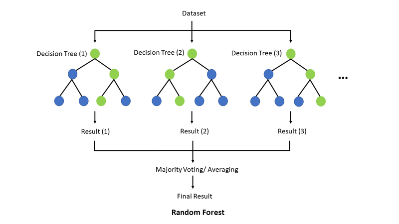
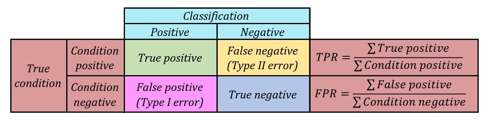
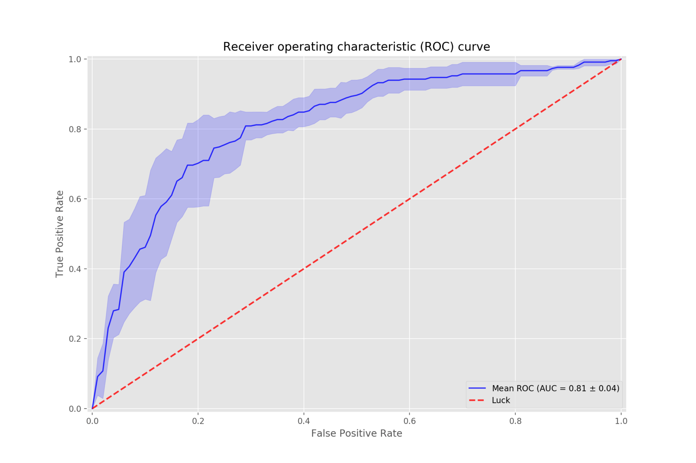
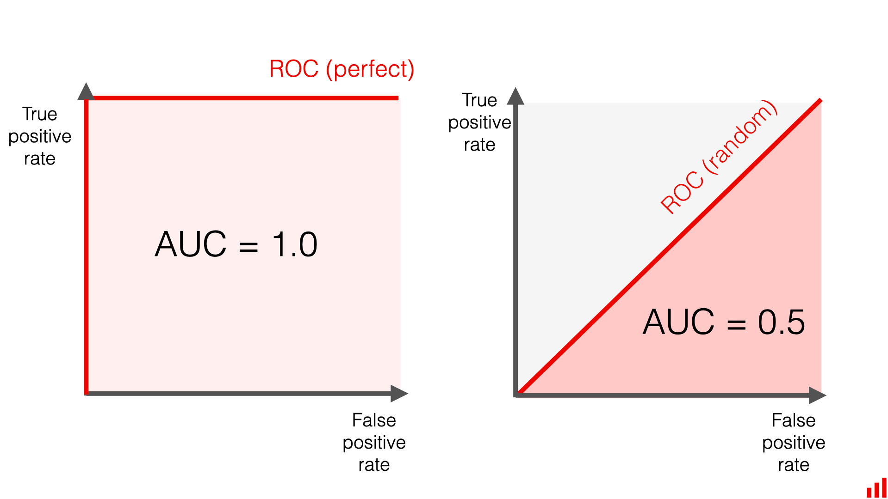
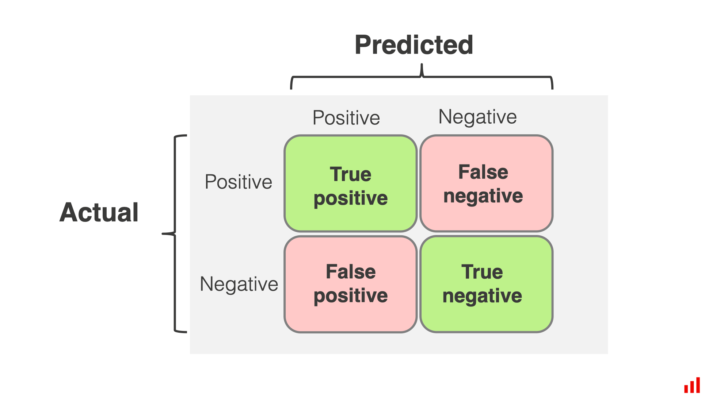

# **Scikit-Learn**

[Scikit-learn](https://scikit-learn.org/stable/user_guide.html) es una de las bibliotecas más populares de Python para Machine Learning. Ofrece herramientas simples y eficientes para el análisis de datos y modelado predictivo. Compatible con NumPy, pandas y matplotlib, es ideal para **construir y evaluar modelos de Machine Learning**.

---

## **Índice**

1. [¿Qué es Machine Learning?](#1-qué-es-machine-learning)
2. [¿Qué es Scikit-Learn?](#2-qué-es-scikit-learn)
3. [Workflow en Scikit-Learn](#3-workflow-en-scikit-learn)
4. [Debugging Warnings en Jupyter](#4-debugging-warnings-en-jupyter)
5. [División de Datos (Splitting Data)](#5-división-de-datos-splitting-data)
6. [Limpieza y Transformación de Datos](#6-limpieza-y-transformación-de-datos-clean-transform-reduce)
7. [Convertir Datos en Números](#7-convertir-datos-en-números)
8. [Manejo de Valores Faltantes](#8-manejo-de-valores-faltantes)
9. [Escalado de Características (Feature Scaling)](#9-escalado-de-características-feature-scaling)
10. [Elegir el Modelo Correcto](#10-elegir-el-modeloestimador-adecuado)
11. [Árboles de Decisión (Decision Trees)](#11-árboles-de-decisión)
12. [Modelos de Ensamblaje](#12-modelos-de-ensamblaje)
13. [Ajustar un Modelo a los Datos](#13-ajustar-un-modelo-a-los-datos)
14. [Hacer Predicciones con un Modelo](#14-predicciones-con-un-modelo)
15. [Evaluación de Modelos de Machine Learning](#15-evaluación-de-modelos-de-machine-learning)
16. [Mejorar un Modelo de Machine Learning](#16-mejorar-un-modelo-de-machine-learning)
17. [Guardar y Cargar Modelos](#17-guardar-y-cargar-modelos)

> [!NOTE] > **¿Cómo obtener ayuda?**
>
> - **Experimenta:** Usa lo que sabes y prueba. Aprender haciendo es clave en ML.
> - **SHIFT + TAB:** Usa esta función en Jupyter para obtener información sobre una función o método.
> - **Busca online:** Investiga en la documentación de [Scikit-Learn](<(https://scikit-learn.org/stable/user_guide.html)>) o en Stack Overflow.
> - **Pregunta:** Si te atascas, pregunta en foros o comunidades de Machine Learning.

---

## **1. ¿Qué es Machine Learning?**

Machine Learning (ML) es una rama de la inteligencia artificial que permite a las máquinas **aprender patrones de datos sin ser explícitamente programadas.**

- **Tipos de ML:**
  - **Supervisado:** Entrenado con datos etiquetados (ej. predicción de precios).
  - **No supervisado:** Identifica patrones en datos sin etiquetas (ej. clustering).
  - **Aprendizaje por refuerzo:** Aprende interactuando con el entorno para maximizar recompensas.


## **2. ¿Qué es Scikit-Learn?**

**Scikit-Learn**, comúnmente llamado `sklearn`, es una biblioteca de código abierto de Python para Machine Learning.

Está construido sobre:

- **NumPy:** Biblioteca de Python para cálculos numéricos.
- **Matplotlib:** Biblioteca para visualización de datos.

Ofrece herramientas para realizar todas las etapas principales de un proyecto de Machine Learning, desde la preparación de datos hasta la construcción y evaluación de modelos.

### ¿Por qué usar Scikit-Learn?

El objetivo principal del Machine Learning es **encontrar patrones en los datos** y usar esos patrones para hacer **predicciones**.

Algunos tipos comunes de problemas de Machine Learning incluyen:

- **Clasificación:** Predecir una categoría (ej. si un email es spam o no).
- **Regresión:** Predecir un número (ej. precio de casas).
- **Clustering:** Agrupar elementos similares sin etiquetas previas.

Para cualquier problema, las etapas son similares:

1. Dividir los datos en conjuntos de entrenamiento y prueba.
2. Elegir un modelo.
3. Ajustar el modelo a los datos.
4. Evaluar el modelo para ver si ha aprendido algo.

Scikit-Learn ofrece implementaciones en Python para realizar todas estas tareas, evitando la necesidad de construirlas desde cero.

## **3. Workflow en Scikit-Learn**

1. **Obtener y preparar los datos**
2. **Dividir los datos**
   - en características (`X`) y etiquetas (`Y`)
   - en conjuntos de entrenamiento y prueba
3. **Elegir un modelo y sus hiperparámetros**
   - Clasificación : `RandomForestClassifier`, `LogisticRegression`, `SVC`.
   - Regresión: `LinearRegression`, `RandomRegressor`.
4. **Ajustar el modelo** a los datos de entrenamiento
5. **Hacer predicciones**: predice etiquetas en datos no vistos
6. **Evaluar el modelo**
   - Clasificación: Usa métricas como precisión, matriz de confusión, etc.
   - Regresión: Usa métricas como `r2_score`, `mean_squared_error`.
7. **Experimentar y mejorar** el modelo si es necesario
   - Ajusta los hiperparámetros con `GridSerachCV`o prueba modelos más avanzados.
   - Experimenta con diferentes técnicas de preprocesamiento.
8. **Guardar y cargar el modelo**

```python
from sklearn.model_selection import train_test_split
from sklearn.linear_model import LinearRegression
from sklearn.metrics import mean_absolute_error

# Ejemplo simple de workflow
X_train, X_test, y_train, y_test = train_test_split(X, y, test_size=0.2, random_state=42) # Dividir los datos
model = LinearRegression() # Modelo elegido
model.fit(X_train, y_train) # Ajustar el modelo
predictions = model.predict(X_test) # Hacer predicciones
error = mean_absolute_error(y_test, predictions) # Evaluar el modelo
```

## **4. Debugging Warnings en Jupyter**

Mientras trabajas en Jupyter Notebook, puedes encontrarte con **mensajes de advertencia** que te alertan sobre **posibles problemas o cambios futuros** en las bibliotecas que utilizas. Estos mensajes son útiles para mejorar tu código, pero a veces pueden ser molestos si estás experimentando o trabajando con código heredado.

### **Tipos comunes de advertencias**

1. **`FutureWarning`:** Indica que algo en tu código será obsoleto en una versión futura.
2. **`DeprecationWarning`:** Similar a `FutureWarning`, pero se usa para elementos que ya están obsoletos.
3. **`UserWarning`:** Mensajes de advertencia personalizados o relacionados con configuraciones específicas.

### **Cómo manejar advertencias en Scikit-Learn**

1. **Lee el mensaje de advertencia completo:**

   - Identifica qué está causando la advertencia. Por ejemplo:
     ```
     FutureWarning: The parameter 'normalize' in function 'LinearRegression' is deprecated and will be removed in version 1.2. Please use 'StandardScaler' instead.
     ```
   - Esto sugiere reemplazar `normalize=True` por el uso de `StandardScaler`.

2. **Consulta la documentación oficial:**

   - La advertencia suele mencionar una solución recomendada. Busca el término o función en la [documentación oficial de Scikit-Learn](https://scikit-learn.org/stable/documentation.html).

3. **Actualiza tu código para evitar advertencias futuras:**

   - Adapta tu código siguiendo las recomendaciones.
   - Ejemplo de corrección:

     ```python
     # Antes (genera FutureWarning)
     from sklearn.linear_model import LinearRegression
     model = LinearRegression(normalize=True)

     # Después (solución recomendada)
     from sklearn.pipeline import make_pipeline
     from sklearn.preprocessing import StandardScaler
     model = make_pipeline(StandardScaler(), LinearRegression())
     ```

4. **Ignorar advertencias temporalmente:**

   - Si necesitas ignorar advertencias durante el desarrollo, puedes usar:
     ```python
     import warnings
     warnings.filterwarnings("ignore", category=FutureWarning)
     ```
     Esto suprime **solo** los mensajes de `FutureWarning`.

5. **Habilitar advertencias para depuración:**
   - Si necesitas volver a habilitar las advertencias:
     ```python
     warnings.filterwarnings("default")
     ```

#### **Ejemplo práctico para `FutureWarning` en Scikit-Learn**

Si estás trabajando con una versión más antigua de Scikit-Learn y ves un `FutureWarning`, actualiza la biblioteca para evitar el problema:

```bash
pip install -U scikit-learn
```

### **Actualizar Scikit-Learn con conda**

Si estás usando **conda** como gestor de entornos, puedes actualizar **Scikit-Learn** y otras bibliotecas directamente desde la terminal. Aquí tienes los pasos para hacerlo:

1. **Activar el entorno Conda:**
   Primero asegúrate de activar el entorno en el que deseas actualizar Scikit-Learn:

   ```bash
   conda activate nombre_del_entorno
   ```

2. **Actualizar Scikit-Learn:**
   Ejecuta el siguiente comando para actualizar Scikit-Learn a la última versión disponible en los canales de Conda:

   ```bash
   conda update scikit-learn
   ```

3. **Confirmar la instalación:**
   Si Conda encuentra una versión más reciente, pedirá confirmación para actualizar. Escribe `y` y presiona **Enter** para proceder.

#### **Actualizar Scikit-Learn a una versión específica:**

Si necesitas una versión específica de Scikit-Learn, usa:

```bash
conda install scikit-learn=1.2.0
```

(Reemplaza `1.2.0` con la versión que necesites.)

#### **Actualizar todo el entorno Conda**

Si prefieres actualizar todas las bibliotecas de tu entorno al mismo tiempo, puedes usar:

```bash
conda update --all
```

#### **Verificar la versión instalada**

Después de actualizar, verifica que tienes la versión correcta:

```python
import sklearn
print(sklearn.__version__)
```

> [!Note] > **Notas importantes**
>
> - Si no encuentras la versión más reciente de Scikit-Learn en los canales predeterminados de Conda, puedes intentar instalarla desde el canal `conda-forge`:
>
> ```bash
> conda install -c conda-forge scikit-learn
> ```
>
> - Actualizar Scikit-Learn puede requerir actualizar otras bibliotecas como **NumPy** y **SciPy**, ya que Scikit-Learn depende de ellas. Conda manejará estas dependencias automáticamente.
> - Si no puedes actualizar, puedes ignorar las advertencias de forma temporal o adaptarte a las nuevas recomendaciones que aparecen en la advertencia.

#### **Buenas prácticas**

- Usa `warnings.filterwarnings("ignore")` solo como última opción o mientras experimentas.
- Actualiza tus bibliotecas regularmente para evitar problemas de compatibilidad.
- Consulta siempre la documentación oficial y las notas de la versión:
  - 🔗 [Notas de versión de Scikit-Learn](https://scikit-learn.org/stable/whats_new.html).

## **5. División de Datos (Splitting Data)**

Un paso crucial en cualquier proyecto de machine learning es dividir los datos en conjuntos de entrenamiento y prueba para evaluar cómo se comporta el modelo con datos no vistos.

La función `train_test_split` de Scikit-Learn divide los datos en dos o más conjuntos:

- **Entrenamiento (`train`):** Datos que el modelo utiliza para aprender patrones.
- **Prueba (`test`):** Datos reservados para evaluar el modelo después del entrenamiento.

Ejemplo básico:

```python
from sklearn.model_selection import train_test_split

X_train, X_test, y_train, y_test = train_test_split(
    X, y,
    test_size=0.2,  # Proporción del conjunto de prueba (20%)
    random_state=42 # Fijar semilla para resultados reproducibles
)
```

- **`test_size`:** Define el porcentaje de datos asignados al conjunto de prueba.
- **`random_state`:** Asegura que los datos se dividan de la misma forma en cada ejecución, útil para experimentos reproducibles.

## **6. Limpieza y Transformación de Datos (Clean, Transform, Reduce)**

#### **Limpieza (`Clean`):**

- Elimina valores faltantes o erróneos para evitar que distorsionen los resultados del modelo.
- Por ejemplo, puedes usar Pandas para eliminar filas con valores nulos:
  ```python
  X.dropna(inplace=True)
  ```

#### **Transformación (`Transform`):**

- Convierte los datos a formatos adecuados, como escalar valores numéricos o codificar variables categóricas.
- Ejemplo: Escalar características numéricas usando `StandardScaler`:
  ```python
  from sklearn.preprocessing import StandardScaler
  scaler = StandardScaler()
  X_scaled = scaler.fit_transform(X)
  ```

#### **Reducción (`Reduce`):**

- Simplifica los datos, por ejemplo, reduciendo la dimensionalidad con PCA si el conjunto de datos tiene muchas características.
- Ejemplo:
  ```python
  from sklearn.decomposition import PCA
  pca = PCA(n_components=2)
  X_reduced = pca.fit_transform(X)
  ```

> [!NOTE] > **Nota Práctica**
>
> - Una división mal realizada puede generar un modelo que no generalice bien.
> - Si los datos son muy pequeños, considera **validación cruzada** en lugar de dividir en `train/test`.
> - Siempre inspecciona los datos después de dividirlos para garantizar que los conjuntos sean representativos:
>
> ```python
> print(X_train.shape, X_test.shape)
> print(y_train.value_counts(), y_test.value_counts())
> ```

## **7. Convertir Datos en Números**

Los algoritmos de machine learning suelen trabajar mejor con datos numéricos. Sin embargo, en muchos casos, los datos contienen **variables categóricas** (como colores, países, tipos de productos, etc.). Para convertir estos datos categóricos en números, Scikit-Learn proporciona herramientas como `LabelEncoder` y `OneHotEncoder`.

### **1. `LabelEncoder`**

El `LabelEncoder` asigna un número único a cada categoría de una columna. Este método es útil cuando las categorías tienen un **orden lógico**, como "bajo", "medio", "alto".

Ejemplo:

```python
from sklearn.preprocessing import LabelEncoder

data = pd.DataFrame({"color": ["red", "blue", "green", "blue", "red"]})

label_encoder = LabelEncoder()
data["color_encoded"] = label_encoder.fit_transform(data["color"])
print(data)
```

**Salida:**

```plaintext
   color  color_encoded
0    red              2
1   blue              0
2  green              1
3   blue              0
4    red              2
```

- **Ventajas:** Simple y directo.
- **Desventajas:** Puede inducir relaciones ordinales incorrectas entre las categorías si no hay un orden lógico.

### **2. `OneHotEncoder`**

El `OneHotEncoder` crea columnas binarias (0 o 1) para cada categoría, evitando que el modelo asuma relaciones ordinales entre categorías.


Ejemplo:

```python
from sklearn.preprocessing import OneHotEncoder

data = pd.DataFrame({"color": ["red", "blue", "green", "blue", "red"]})

one_hot_encoder = OneHotEncoder()
encoded = one_hot_encoder.fit_transform(data[["color"]])
print(encoded.toarray())  # Convertir a matriz NumPy para ver los resultados
```

**Salida:**

```plaintext
[[0. 0. 1.]
 [1. 0. 0.]
 [0. 1. 0.]
 [1. 0. 0.]
 [0. 0. 1.]]
```

- Las columnas representan categorías en orden alfabético: `["blue", "green", "red"]`.
- **Ventajas:** Evita relaciones ordinales falsas.
- **Desventajas:** Incrementa el tamaño del dataset si hay muchas categorías.

> [!NOTE]
>
> - En una versión más nueva de Scikit-Learn (0.23+), la clase `OneHotEncoder` puede manejar valores `None` y `NaN`.
> - 🔗 [Documentación OneHotEncoder Scikit-Learn](https://scikit-learn.org/stable/modules/generated/sklearn.preprocessing.OneHotEncoder.html)

### **3. Usar `ColumnTransformer` con `OneHotEncoder`**

Si tienes varias columnas categóricas y numéricas en tu dataset, puedes usar `ColumnTransformer` para aplicar transformaciones específicas a cada tipo de columna.

Ejemplo práctico:

```python
from sklearn.compose import ColumnTransformer
from sklearn.preprocessing import OneHotEncoder

data = pd.DataFrame({
    "color": ["red", "blue", "green", "blue", "red"],
    "size": ["S", "M", "L", "M", "S"],
    "price": [10, 20, 15, 25, 30]
})

categorical_features = ["color", "size"]
one_hot_encoder = OneHotEncoder()

transformer = ColumnTransformer(
   transformers=[("one_hot", one_hot_encoder, categorical_features)],
   remainder="passthrough"  # Deja las columnas no especificadas sin cambios
)

transformed_data = transformer.fit_transform(data)
print(transformed_data)
```

**Salida:**

```plaintext
[[0. 0. 1. 1. 0. 0. 10.]
 [1. 0. 0. 0. 1. 0. 20.]
 [0. 1. 0. 0. 0. 1. 15.]
 [1. 0. 0. 0. 1. 0. 25.]
 [0. 0. 1. 1. 0. 0. 30.]]
```

### **Tips para elegir el método adecuado:**

1. Usa `LabelEncoder` si tus categorías tienen un **orden lógico** o si son simples y están contenidas en una única columna.
2. Usa `OneHotEncoder` si quieres evitar relaciones ordinales falsas entre categorías.
3. Si trabajas con datasets más complejos (mixtos con columnas categóricas y numéricas), utiliza `ColumnTransformer` para combinar transformaciones.

## **8. Manejo de Valores Faltantes**

### Con pandas:

```python
df["column"] = df["column"].fillna(value)
```

### Con Scikit-Learn:

```python
from sklearn.impute import SimpleImputer
imputer = SimpleImputer(strategy="mean")
imputed = imputer.fit_transform(df)
```

## **9. Escalado de Características (Feature Scaling)**

Una vez que tus datos estén en formato numérico, probablemente querrás aplicarles una transformación adicional: **escalado de características (Feature Scaling)**. Esto significa asegurarte de que **todos los datos numéricos estén en la misma escala**.

**¿Por qué es importante?**

Imagina que estás tratando de predecir el precio de venta de coches y el kilometraje varía entre 6,000 y 345,000, mientras que el costo promedio de reparaciones anteriores varía entre 100 y 1,700. Un algoritmo de aprendizaje automático podría tener dificultades para encontrar patrones en estas variables con rangos tan diferentes.

Para solucionar esto, existen dos tipos principales de escalado de características:

1. **Normalización (`MinMaxScaler`):**

   - Este método reescala todos los valores numéricos para que estén entre 0 y 1.
   - El valor más bajo estará cerca de 0, y el más alto estará cerca de 1.
   - [Scikit-Learn proporciona la clase `MinMaxScaler`](https://scikit-learn.org/stable/modules/generated/sklearn.preprocessing.StandardScaler.html) para realizar esta operación.

2. **Estandarización (`StandardScaler`):**

   - Este método resta la media de cada característica, de modo que los valores resultantes tengan una media de 0.
   - Luego escala las características a varianza unitaria (dividiendo por la desviación estándar).
   - [Scikit-Learn proporciona la clase `StandardScaler`](https://scikit-learn.org/stable/modules/generated/sklearn.preprocessing.MinMaxScaler.html) para esta tarea.

   ```python
   from sklearn.preprocessing import StandardScaler
   scaler = StandardScaler()
   scaled_data = scaler.fit_transform(data)
   ```

> [!NOTE] **Notas importantes:**
>
> - El **escalado de características generalmente no se aplica a la variable objetivo** (la que intentas predecir).
> - El **escalado de características no suele ser necesario en modelos basados en árboles** (por ejemplo, Random Forest), ya que estos pueden manejar características con diferentes escalas.

**📖 Lectura adicional**

- **[Feature Scaling - why is it required?](https://rahul-saini.medium.com/feature-scaling-why-it-is-required-8a93df1af310)** por Rahul Saini.
- **[Feature Scaling with Scikit-Learn](https://benalexkeen.com/feature-scaling-with-scikit-learn/)** por Ben Alex Keen.
- **[Feature Scaling for Machine Learning: Understanding the Difference Between Normalization vs. Standardization](https://www.analyticsvidhya.com/blog/2020/04/feature-scaling-machine-learning-normalization-standardization/)** por Aniruddha Bhandari.

## **10. Elegir el modelo/estimador adecuado**

A menudo, la parte más difícil de resolver un problema de aprendizaje automático puede ser encontrar el estimador adecuado para el trabajo. Diferentes estimadores son más adecuados para distintos tipos de datos y problemas.

Este [diagrama de flujo de Scikit-learn](https://scikit-learn.org/1.5/machine_learning_map.html) está diseñado como una guía aproximada para ayudar a los usuarios a abordar problemas en relación con qué estimadores probar en sus datos. Puedes hacer clic en cualquier estimador del gráfico para ver su documentación. El emoji 😭 debe interpretarse como _"si este estimador no logra el resultado deseado, sigue la flecha e intenta con el siguiente"_.


## **11. Árboles de Decisión**

Un **Árbol de Decisión** es un modelo de machine learning que utiliza una estructura jerárquica de decisiones para dividir los datos en ramas según ciertas reglas condicionales. Se utiliza tanto en problemas de **clasificación** como de **regresión**.


### **Características principales**

- **Fácil de interpretar:** La estructura de decisiones permite visualizar cómo el modelo llega a una conclusión.
- **Capacidad de manejar datos categóricos y numéricos.**
- **Propenso al overfitting:** Sin regularización, los árboles de decisión pueden ajustarse demasiado a los datos de entrenamiento.

### **Implementación en Scikit-Learn**

```python
from sklearn.tree import DecisionTreeClassifier

# Crear el modelo
model = DecisionTreeClassifier()

# Entrenar el modelo
model.fit(X_train, y_train)

# Hacer predicciones
predictions = model.predict(X_test)
```

### **Visualización de un Árbol de Decisión**

Puedes visualizar el árbol utilizando `plot_tree` de Scikit-Learn:

```python
from sklearn.tree import plot_tree

plt.figure(figsize=(12, 8))
plot_tree(model, filled=True, feature_names=X.columns, class_names=["Clase 0", "Clase 1"])
plt.show()
```

## **12. Modelos de Ensamblaje**

Un **Modelo de Ensamblaje** combina múltiples modelos (como árboles de decisión) para mejorar la precisión, robustez y generalización.

### **Tipos de Modelos de Ensamblaje**

1. **Bagging (Bootstrap Aggregating):** Entrena varios modelos independientes (como árboles de decisión) en subconjuntos de los datos y combina sus predicciones (e.g., Random Forest).
2. **Boosting:** Entrena modelos secuencialmente, corrigiendo los errores del modelo anterior (e.g., Gradient Boosting, XGBoost).
3. **Stacking:** Combina diferentes tipos de modelos y utiliza otro modelo para aprender de sus predicciones.

### **Random Forest**

Un **Random Forest** es un tipo de modelo de ensamblaje basado en Bagging que combina múltiples árboles de decisión.



#### **Ventajas:**

- Reduce el overfitting que puede ocurrir con un solo árbol de decisión.
- Maneja características numéricas y categóricas.
- Es robusto frente a datos faltantes y valores atípicos.

#### **Implementación en Scikit-Learn**

```python
from sklearn.ensemble import RandomForestClassifier

# Crear el modelo
rf_model = RandomForestClassifier(n_estimators=100, random_state=42)

# Entrenar el modelo
rf_model.fit(X_train, y_train)

# Hacer predicciones
rf_predictions = rf_model.predict(X_test)
```

### **Referencias adicionales**

- 🔗 [Explicación Simple de Random Forest](https://williamkoehrsen.medium.com/random-forest-simple-explanation-377895a60d2d)

## **13. Ajustar un Modelo a los Datos**

```python
model.fit(X_train, y_train)
```

El método `.fit()` en Scikit-Learn se utiliza para **entrenar un modelo**.

Toma como entrada:

- `X_train`: Los datos de entrada (características o variables independientes).
- `y_train`: Las etiquetas (objetivo o variable dependiente).

Durante este proceso:

1. El modelo aprende los **patrones** o **relaciones** entre `X_train` y `y_train`.
2. Los parámetros del modelo se ajustan para minimizar el error y mejorar la predicción en futuros datos.

> `.fit()` ajusta el modelo a los datos de entrenamiento para que pueda realizar predicciones en datos nuevos.

## **14. Hacer Predicciones con un Modelo**

Una vez que el modelo ha sido ajustado a los datos mediante `.fit()`, puedes usarlo para hacer predicciones sobre nuevos datos. Esto se logra principalmente utilizando los métodos `predict()` y `predict_proba()`.

### **Métodos de Predicción**

#### **`predict()`**

El método `predict()` genera predicciones concretas basadas en el modelo ajustado.

- Para problemas de **clasificación**, devuelve la **clase más probable**.
- Para problemas de **regresión**, devuelve el **valor predicho** (número).

```python
y_preds = model.predict(X_test)  # Predicciones sobre datos de prueba
```

#### **`predict_proba()`**

El método `predict_proba()` genera las probabilidades de pertenencia a cada clase en problemas de **clasificación**.

- Útil si quieres entender la confianza del modelo en su predicción.
- Devuelve una matriz donde cada fila corresponde a una instancia y cada columna a la probabilidad de una clase.

```python
y_proba = model.predict_proba(X_test)
```

Ejemplo de salida para una clasificación binaria:

```python
array([[0.1, 0.9],  # Probabilidad de clase 0 y clase 1
       [0.8, 0.2]])
```

### **Evaluar Predicciones**

Existen varias formas de comparar las predicciones del modelo con las etiquetas verdaderas para evaluar su desempeño:

1. **Comparación directa**  
   Compara las predicciones con las etiquetas verdaderas utilizando operadores lógicos.

   ```python
   np.mean(y_preds == y_test)
   ```

2. **Método `.score()` del modelo**  
   Muchos modelos de Scikit-Learn tienen un método `.score()` que calcula una métrica de desempeño estándar (por ejemplo, precisión para clasificación o R² para regresión).

   ```python
   model.score(X_test, y_test)
   ```

3. **Métricas específicas con Scikit-Learn**  
   Usa funciones del módulo `metrics` para calcular métricas de evaluación detalladas.
   ```python
   from sklearn.metrics import accuracy_score
   accuracy_score(y_test, y_preds)
   ```

### **Ejemplo Completo**

```python
# Hacer predicciones
y_preds = model.predict(X_test)

# Calcular precisión directamente
accuracy = np.mean(y_preds == y_test)
print(f"Accuracy (manual): {accuracy}")

# Calcular precisión con .score()
model_accuracy = model.score(X_test, y_test)
print(f"Accuracy (model score): {model_accuracy}")

# Calcular precisión con una métrica específica
from sklearn.metrics import accuracy_score
accuracy_metric = accuracy_score(y_test, y_preds)
print(f"Accuracy (accuracy_score): {accuracy_metric}")
```

> **Nota:** Aunque estas tres formas pueden producir resultados similares, usar funciones específicas de `metrics` como `accuracy_score` es más flexible para escenarios complejos, como calcular múltiples métricas a la vez.

## **15. Evaluación de Modelos de Machine Learning**

Evaluar los resultados de un modelo de machine learning es tan crucial como construirlo. Cada tipo de problema, ya sea de **clasificación o regresión**, requiere métricas de evaluación específicas que permitan medir el rendimiento del modelo de manera adecuada. A continuación, se describen algunas de las métricas más importantes y utilizadas para evaluar modelos en ambos contextos.

### Métricas/Técnicas de Evaluación para Modelos de **Clasificación**

#### **Cross-Validation** (Validación Cruzada)

Divide los datos en múltiples partes para entrenar y probar el modelo varias veces, asegurando una evaluación más robusta y menos dependiente de una sola división de datos.

```python
from sklearn.model_selection import cross_val_score
scores = cross_val_score(model, X, y, cv=5)  # 5 divisiones
print("Mean Cross-Validation Score:", scores.mean())
```

Divide el conjunto de datos en múltiples partes, entrena y evalúa el modelo en cada una y calcula el rendimiento promedio.


> 🔗 [Corss-validation: evaluating estimator performance (Scikit-Learn)](https://scikit-learn.org/stable/modules/cross_validation.html)

#### **Accuracy** (Exactitud)

Porcentaje de predicciones correctas entre el total de predicciones.

```python
from sklearn.metrics import accuracy_score
accuracy = accuracy_score(y_test, y_preds)
print("Accuracy:", accuracy)
```

Es la proporción de predicciones correctas del modelo, expresada en forma decimal. Una precisión perfecta es igual a 1.0.

#### **Precision** (Precisión)

Indica la proporción de identificaciones positivas (predicciones de clase 1 del modelo) que fueron realmente correctas. Un modelo sin falsos positivos tiene una precisión de 1.0.

🔗 [`precision_score` Scikit-Learn](https://scikit-learn.org/stable/modules/generated/sklearn.metrics.precision_score.html#sklearn.metrics.precision_score)

#### **Recall** (Exhaustividad)

Mide la proporción de verdaderos positivos que fueron clasificados correctamente. Un modelo sin falsos negativos tiene un recall de 1.0.

```python
from sklearn.metrics import recall_score
recall_score(y_true, y_pred, average='macro')
```

🔗 [`recall_score` Scikit-Learn](https://scikit-learn.org/stable/modules/generated/sklearn.metrics.recall_score.html#sklearn.metrics.recall_score)

#### **F1 Score**

Combina precisión y recall en una única métrica. Un modelo perfecto alcanza un F1 score de 1.0.

🔗 [`f1_score` Scikit-Learn](https://scikit-learn.org/stable/modules/generated/sklearn.metrics.f1_score.html#sklearn.metrics.f1_score)

#### **ROC Curve** (Curva ROC)

Gráfico que muestra la relación entre la **tasa de verdaderos positivos** y la **tasa de falsos positivos**. Útil para evaluar modelos binarios.



```python
from sklearn.metrics import roc_curve
fpr, tpr, thresholds = roc_curve(y_test, y_proba[:, 1])
plt.plot(fpr, tpr)
```



#### **ROC Curve + AUC (Área Bajo la Curva)**

Resume el desempeño del modelo en un solo valor (AUC). El AUC representa el área debajo de la curva ROC. Un modelo perfecto tiene un AUC de `1.0`.

- 🔗 [Receiver operating characteristic - Wikipedia](https://en.wikipedia.org/wiki/Receiver_operating_characteristic)
- 🔗 [Curva ROC - Wikipedia](https://es.wikipedia.org/wiki/Curva_ROC)

```python
from sklearn.metrics import roc_auc_score
auc = roc_auc_score(y_test, y_proba[:, 1])
print("AUC:", auc)
```

Las **curvas ROC** y las **métricas AUC** son métricas de evaluación para modelos de clasificación binaria (un modelo que predice una cosa u otra, como enfermedad cardíaca o no).

La **curva ROC** compara la tasa de verdaderos positivos (tpr) versus la tasa de falsos positivos (fpr) en diferentes umbrales de clasificación.

- Verdadero positivo = el modelo predice 1 cuando la verdad es 1
- Falso positivo = el modelo predice 1 cuando la verdad es 0
- Verdadero negativo = el modelo predice 0 cuando la verdad es 0
- Falso negativo = el modelo predice 0 cuando la verdad es 1

La **[métrica AUC](https://scikit-learn.org/stable/modules/generated/sklearn.metrics.roc_auc_score.html)** te dice qué tan bien está tu modelo al elegir entre clases (por ejemplo, qué tan bien está al decidir si alguien tiene enfermedad cardíaca o no). Un modelo perfecto obtendrá una puntuación AUC de `1`.



> [!NOTE] > **Recursos para más información sobre estas métricas:**
>
> - [ROC and AUC, Clearly Explained!](https://www.youtube.com/watch?v=4jRBRDbJemM) por StatQuest
> - [Documentación ROC en Scikit-Learn](https://scikit-learn.org/stable/auto_examples/model_selection/plot_roc.html) (contiene ejemplos de código)
> - [Cómo se calculan la curva ROC y AUC](https://developers.google.com/machine-learning/crash-course/classification/roc-and-auc?hl=es-419) por el equipo de Machine Learning de Google.

#### **Matriz de Confusión**

Tabla que muestra las predicciones correctas e incorrectas para cada clase.

```python
from sklearn.metrics import confusion_matrix
cm = confusion_matrix(y_test, y_preds)
print(cm)
```

También es posible visualizar una matriz de confusión usando `pd.crosstab()`:

```python
pd.crosstab(y_test,
            y_preds,
            rownames=["Actual Label"],
            colnames=["Predicted Label"])
```

Compara los valores predichos con los valores reales en forma tabular. Si el modelo es 100% preciso, todos los valores estarán en la diagonal de la matriz.



> 🔗 [Confusion Matrix - Wikipedia](https://en.wikipedia.org/wiki/Confusion_matrix)
> 🔗 [Simple guide to Confusion Matrix terminology - dataschool](https://www.dataschool.io/simple-guide-to-confusion-matrix-terminology/)

#### **Classification Report**

[Scikit-learn ofrece la función `classification_report()`](https://scikit-learn.org/stable/modules/generated/sklearn.metrics.classification_report.html), que muestra un resumen detallado de métricas clave como precisión, recall y F1 score.

```python
from sklearn.metrics import classification_report
report = classification_report(y_test, y_preds)
print(report)
```

---

> **¿Qué métrica de clasificación usar?** > **Accuracy:** Ideal si las clases están equilibradas (por ejemplo, igual cantidad de muestras con etiquetas 0 y 1).
> **Precision y Recall:** Útiles cuando las clases están desbalanceadas.
>
> - Si los falsos positivos son más perjudiciales que los falsos negativos, prioriza la **precisión**.
> - Si los falsos negativos son más perjudiciales que los falsos positivos, prioriza el **recall**.
>   **F1 Score:** Buena combinación entre precisión y recall.
>   **Matriz de confusión:** Siempre es útil para visualizar cómo funciona el modelo.

---

### Métricas/Técnicas de Evaluación para Modelos de **Regresión**

#### **R² Score** (Coeficiente de Determinación)

Indica qué porcentaje de la variación en los datos depende de las características del modelo. El mejor valor posible es 1.0.

```python
from sklearn.metrics import r2_score
r2 = r2_score(y_test, y_preds)
print("R² Score:", r2)
```

Compara las predicciones del modelo con la media de los valores reales. Los valores pueden variar desde -∞ (modelo muy malo) hasta 1 (modelo perfecto). Por ejemplo:

- Un modelo que solo predice la media de los valores tiene un R² de 0.
- Un modelo que predice perfectamente los valores tiene un R² de 1.

> 🔗 [`r2_score` Scikit-Learn](https://scikit-learn.org/stable/modules/generated/sklearn.metrics.r2_score.html)

#### **Mean Absolute Error (MAE)**

Promedio de las diferencias absolutas entre valores predichos y reales. Proporciona una idea de cuánto se equivocaron las predicciones en promedio. Mide el error en las mismas unidades que la variable dependiente.

```python
from sklearn.metrics import mean_absolute_error
mae = mean_absolute_error(y_test, y_preds)
print("MAE:", mae)
```

> 🔗 [`mean_absolute_error` Scikit-Learn](https://scikit-learn.org/stable/modules/generated/sklearn.metrics.mean_absolute_error.html)

#### **Mean Squared Error (MSE)**

Promedio de los errores al cuadrado, penalizando más los errores grandes.

```python
from sklearn.metrics import mean_squared_error
mse = mean_squared_error(y_test, y_preds)
print("MSE:", mse)
```

Promedio de las diferencias cuadradas entre las predicciones y los valores reales. Al elevar las diferencias al cuadrado:

- Se eliminan los valores negativos.
- Se amplifican los errores grandes.

> 🔗 [`mean_squared_error` Scikit-Learn](https://scikit-learn.org/stable/modules/generated/sklearn.metrics.mean_squared_error.html)

---

> _¿Qué métrica de regresión usar?_ > **R²:** Similar a la precisión en clasificación. Da una indicación general de qué tan bien funciona el modelo (valores cercanos a 1.0 son mejores), pero no indica cuánto se equivoca en promedio.
> **MAE:** Muestra cuán lejos están en promedio las predicciones del modelo de los valores reales.
> **MSE:** Útil si deseas penalizar más los errores grandes.
>
> - **Prioriza MAE:** Si un error de $10,000 es el doble de malo que un error de $5,000.
> - **Prioriza MSE:** Si un error de $10,000 es más de dos veces peor que un error de $5,000.

---

> [!NOTE] >**Consejo Práctico**
>
> - **Clasificación:** Usa `accuracy_score` como métrica inicial y complementa con `classification_report` para analizar más detalles. La `roc_auc_score` es ideal si tienes probabilidades.
> - **Regresión:** Comienza con `r2_score` para evaluar el ajuste general del modelo y complementa con `mae` o `mse` dependiendo de si los errores grandes son críticos o no.

### Recursos adicionales

- 🔗 [Metrics and scoring: quantifying the quality of predictions - Scikit-Learn](https://scikit-learn.org/stable/modules/model_evaluation)
- 🔗 [Beyond Accuracy: Precision and Recall](https://towardsdatascience.com/beyond-accuracy-precision-and-recall-3da06bea9f6c)
- 🔗 [Stack Overflow answer describing MSE (mean squared error) and RSME (root mean squared error)](https://stackoverflow.com/questions/17197492/is-there-a-library-function-for-root-mean-square-error-rmse-in-python/37861832#37861832)

## **16. Mejorar un Modelo de Machine Learning**

- Ajustar hiperparámetros con `GridSearchCV`.
- Añadir más datos o limpiar los existentes.

## **17. Guardar y Cargar Modelos**

```python
import joblib
joblib.dump(model, 'model.pkl')
loaded_model = joblib.load('model.pkl')
```

---
