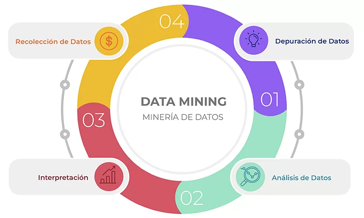
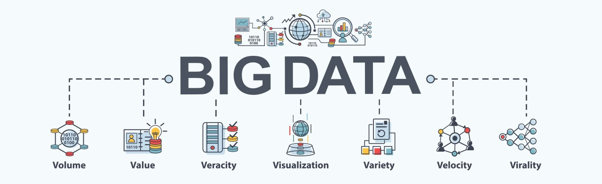
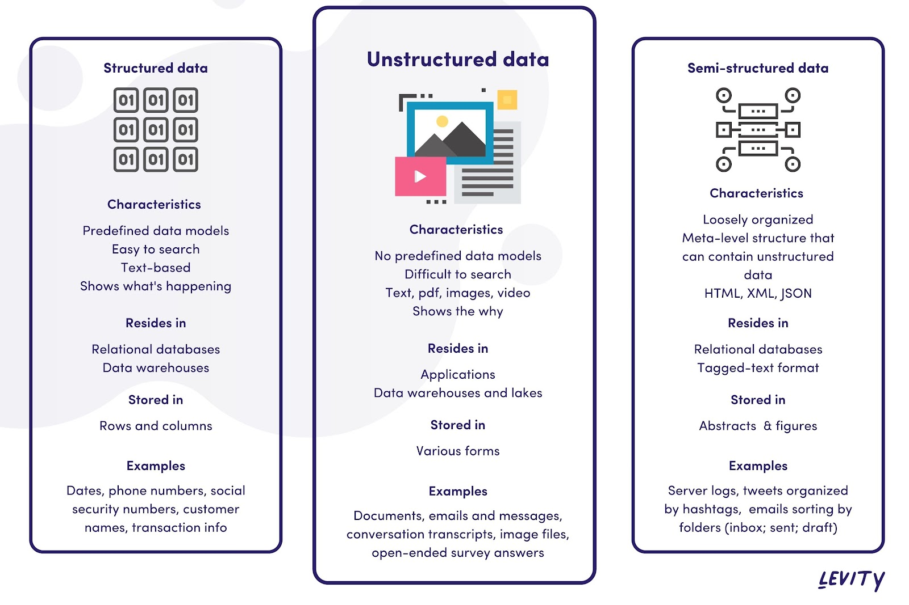
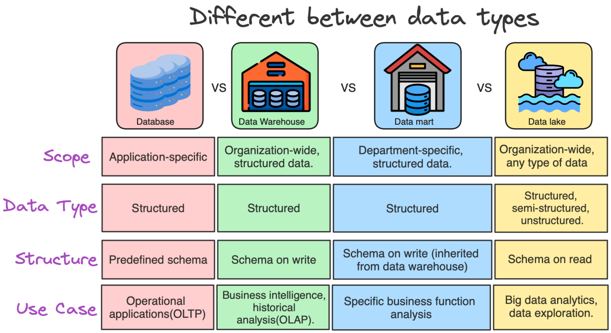
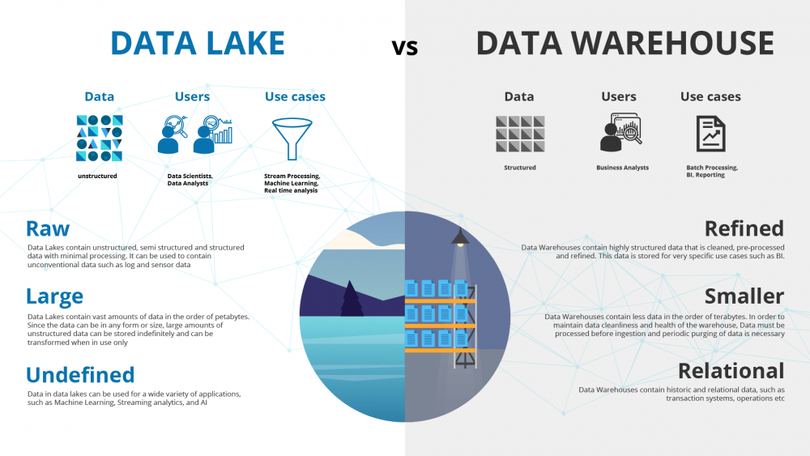
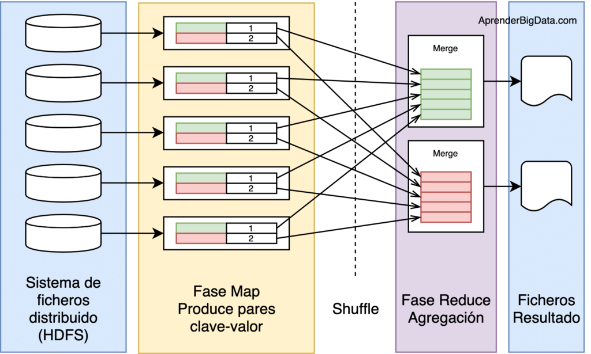
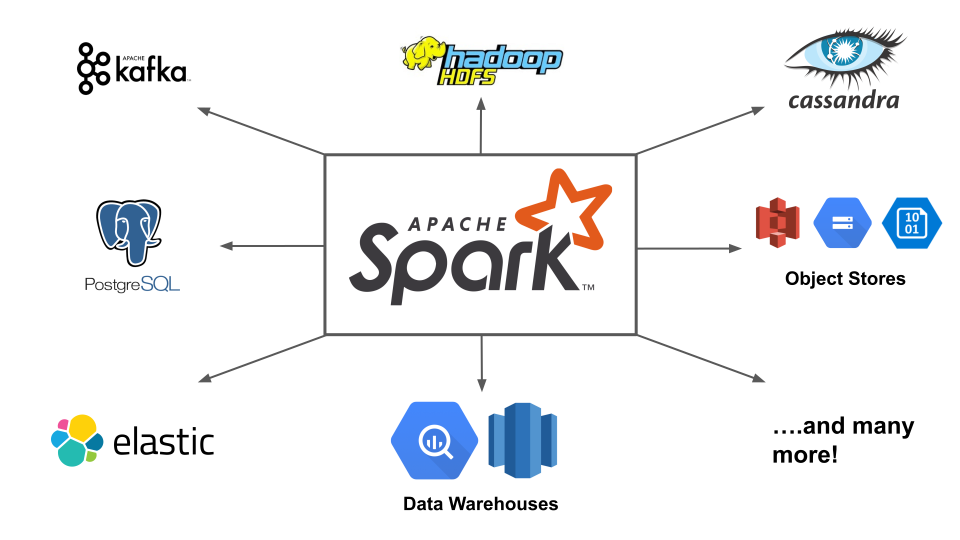
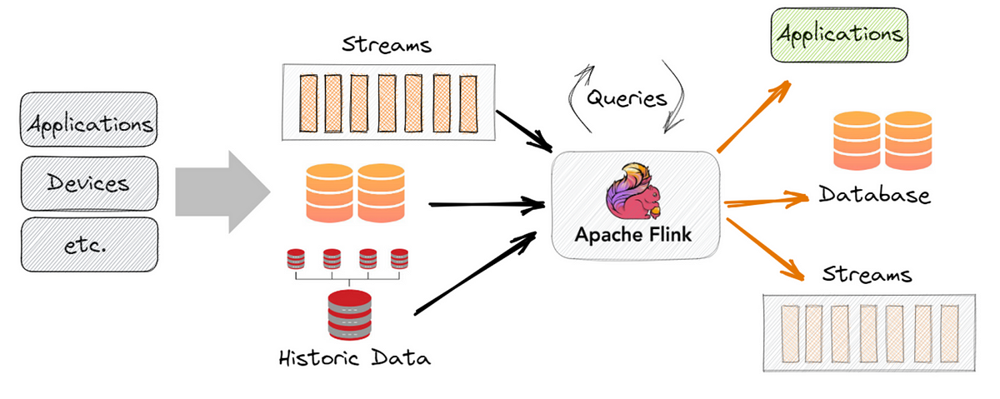

# Data Engineering

## Índice

1. [¿Qué es Data Engineering?](#¿qué-es-data-engineering)
2. [La Figura del Ingeniero de Datos](#la-figura-del-ingeniero-de-datos)
3. [Conceptos Clave en Data Engineering](#conceptos-clave-en-data-engineering)
   - [Data Mining (Minería de Datos)](#1-data-mining-minería-de-datos)
   - [Big Data](#2-big-data)
   - [Data Pipeline](#3-data-pipeline)
4. [Tipos de Datos](#tipos-de-datos)
   - [Datos Estructurados](#1-datos-estructurados)
   - [Datos Semiestructurados](#2-datos-semiestructurados)
   - [Datos No Estructurados](#3-datos-no-estructurados)
   - [Datos Binarios](#4-datos-binarios)
5. [Tipos de Bases de Datos](#tipos-de-bases-de-datos)
6. [Propiedades ACID de una Base de Datos](#propiedades-acid-de-una-base-de-datos)
7. [OLTP y OLAP](#oltp-y-olap)
8. [Hadoop, HDFS y MapReduce](#hadoop-hdfs-y-mapreduce)
9. [Apache Spark y Apache Flink](#apache-spark-y-apache-flink)
10. [Kafka y Stream Processing](#kafka-y-stream-processing)

## ¿Qué es Data Engineering?

Data Engineering (Ingeniería de Datos) se refiere al **proceso de diseñar, construir y gestionar sistemas y arquitecturas para recopilar, almacenar y analizar grandes volúmenes de datos**. Es una disciplina esencial dentro de la Ciencia de Datos y el Big Data, encargándose de que los datos estén disponibles, sean confiables y estén listos para ser analizados.

Los ingenieros de datos diseñan **pipelines**, integran datos desde múltiples fuentes y aseguran que los sistemas sean escalables y eficientes.

🔗 [Data Engineering - Wikipedia](https://en.wikipedia.org/wiki/Data_engineering)

## La Figura del Ingeniero de Datos

El ingeniero de datos es responsable de construir y optimizar los sistemas que permiten que los datos sean accesibles y útiles para los analistas, científicos de datos y aplicaciones empresariales. Sus principales responsabilidades incluyen:

1. **Diseño de Pipelines de Datos:** Creación de procesos que extraen, transforman y cargan (ETL/ELT) datos desde diversas fuentes hacia almacenes de datos.
2. **Gestín de Bases de Datos:** Configuración, administración y optimización de bases de datos relacionales y no relacionales.
3. **Calidad de los Datos:** Implementación de procesos para asegurar la integridad, exactitud y consistencia de los datos.
4. **Optimización de Rendimiento:** Diseño de sistemas escalables que puedan manejar grandes volúmenes de datos y adaptarse al crecimiento.
5. **Automatización:** Uso de herramientas y lenguajes como Python, Spark y Airflow para automatizar tareas repetitivas.

## Conceptos Clave en Data Engineering

### 1. Data Mining (Minería de Datos)

Es el proceso de descubrir patrones, relaciones y conocimientos útiles en grandes conjuntos de datos. Utiliza técnicas de estadística, aprendizaje automático y visualización para extraer información relevante.

**Ejemplo:** Encontrar correlaciones entre las compras de productos en un supermercado para crear ofertas personalizadas.

### 2. Big Data

Hace referencia a conjuntos de datos extremadamente grandes y complejos que no pueden ser gestionados con herramientas y métodos tradicionales. Sus principales características son:

- **Volumen:** Cantidad masiva de datos.
- **Velocidad:** Datos generados a gran velocidad.
- **Variedad:** Datos estructurados, no estructurados y semiestructurados.
- **Veracidad:** Calidad y confiabilidad de los datos.

**Ejemplo:** Datos generados por redes sociales, sensores IoT o transacciones financieras.

### 3. Data Pipeline

Un data pipeline es una serie de procesos que mueven los datos desde su origen hasta su destino final (almacén de datos, dashboard, modelo de machine learning, etc.). Incluye:

- **Extracción:** Captura de datos desde múltiples fuentes.
- **Transformación:** Limpieza, formateo y enriquecimiento de los datos.
- **Carga:** Inserción de datos en el destino final.

**Ejemplo:** Un pipeline que extrae datos de APIs, los convierte a formato JSON y los carga en un almacén como Amazon Redshift.

## Tipos de Datos

### 1. Datos Estructurados

- **Definición:** Datos organizados en filas y columnas, como en bases de datos relacionales.
- **Ejemplo:** Registros de clientes con campos como nombre, edad y correo electrónico.
- **Uso:** Fácil de consultar con SQL.

### 2. Datos Semiestructurados

- **Definición:** Datos que no están organizados en un formato tabular, pero tienen una estructura definida.
- **Ejemplo:** Archivos JSON, XML, y logs.
- **Uso:** Requiere parsers para convertirlos en formatos estructurados.

### 3. Datos No Estructurados

- **Definición:** Datos sin un formato predefinido.
- **Ejemplo:** Videos, imágenes, audio y textos sin etiquetas.
- **Uso:** Procesados mediante técnicas avanzadas como NLP o visión por computadora.

### 4. Datos Binarios

- **Definición:** Datos codificados en formato binario para el almacenamiento y procesamiento eficiente.
- **Ejemplo:** Archivos de imágenes (JPEG, PNG), videos (MP4) o software ejecutable.
- **Uso:** Procesados directamente por aplicaciones especializadas.

## Tipos de Bases de Datos

1. **Bases de Datos Relacionales (SQL):**
   - Organizan datos en tablas con relaciones definidas.
   - Ejemplos: MySQL, PostgreSQL, Oracle.
   - Uso: Ideal para datos estructurados.
   - **Roles que las usan:**
      - Ingeniero de Software: Para gestionar datos de aplicaciones backend.
      - Desarrollador de Software: CRUD y gestión de datos estructurados.
      - Analista de Datos: Para consultas analíticas y reportes.
      - Business Intelligence: Para generar reportes empresariales

2. **Bases de Datos No Relacionales (NoSQL):**
   - Diseñadas para manejar datos semiestructurados y no estructurados.
   - Tipos: Documentos (MongoDB), Clave-Valor (Redis), Columnar (Cassandra), Grafos (Neo4j).
   - Uso: Datos en tiempo real, escalabilidad horizontal.
   - **Roles que las usan:**
      - Ingeniero de Datos: Para manejar datos semiestructurados y en tiempo real.
      - Desarrollador de Aplicaciones: Datos de configuración y sincronización en tiempo real.
      - Desarrollador Móvil: Bases de datos como Firebase para aplicaciones móviles.
      - Científico de Datos: Datos semiestructurados para análisis avanzado.

3. **Data Warehouses:**
   - Almacenes de datos para análisis a gran escala.
   - **Estructura:** Diseñado para almacenar datos estructurados, organizados en filas y columnas en un formato tabular (como bases de datos relacionales).
   - **Propósito:** Optimizado para el análisis de datos históricos y generación de informes. Es ideal para consultas rápidas y análisis empresariales.
   - **Procesamiento de Datos:** Los datos se procesan (ETL: extracción, transformación y carga) antes de almacenarse, lo que asegura calidad, consistencia y formato.
   - **Ejemplos:** Amazon Redshift, Google BigQuery, Snowflake.
   - **Uso:** Analizar tendencias históricas, generar reportes financieros, estudios de mercado.
   - **Roles que las usan:**
      - Ingeniero de Datos: Para almacenar datos procesados y listos para análisis.
      - Analista de Datos: Para realizar análisis de grandes volúmenes de datos históricos.
      - Business Intelligence: Generar reportes estratégicos y dashboards empresariales.
      - Ingeniero de Machine Learning: Preparación de datos para modelos.

4. **Data Lakes:**
   - Repositorios para almacenar datos en su forma nativa.
   - **Estructura:** Almacena datos en su forma nativa, ya sean estructurados, semiestructurados (JSON, XML) o no estructurados (imágenes, videos, texto, etc.).
   - **Propósito:** Diseñado para almacenar grandes volúmenes de datos sin procesar, que pueden ser usados posteriormente para análisis avanzados como machine learning o big data.
   - **Procesamiento de Datos:** Los datos se almacenan tal cual se generan y se procesan solo cuando se necesitan (ELT: extracción, carga y transformación).
   - **Ejemplo:** Hadoop Distributed File System (HDFS), Amazon S3.
   - **Uso:** Análisis exploratorio de datos, procesamiento de datos en tiempo real, preparación de datos para modelos de machine learning.
   - **Roles que las usan:**
      - Ingeniero de Datos: Almacenamiento de datos en bruto para procesamiento futuro.
      - Científico de Datos: Análisis exploratorio y preparación de datos no estructurados.
      - Ingeniero de Machine Learning: Entrenamiento de modelos con grandes volúmenes de datos no estructurados.

> 🔗 **Recurso adicional:** [Learn SQL - free online tutorial](https://www.khanacademy.org/computing/computer-programming/sql#concept-intro)

### Diferencias Clave entre Data Warehouses y Data Lakes

| Característica       | Data Warehouse            | Data Lake                |
|----------------------|---------------------------|--------------------------|
| **Tipo de datos**    | Estructurados            | Cualquier tipo (sin procesar) |
| **Transformación**   | Preprocesados (ETL)      | Sin procesar (ELT)       |
| **Propósito**        | Análisis y reportes      | Almacenamiento masivo, análisis avanzado |
| **Formato**          | Tablas relacionales      | Archivos diversos        |
| **Costo**            | Mayor (procesamiento previo) | Menor (almacenamiento simple) |
| **Ejemplos**         | Snowflake, Redshift      | HDFS, Amazon S3          |

## Propiedades ACID de una Base de Datos

**ACID** es el acrónimo de **Atomicidad, Consistencia, Aislamiento y Durabilidad**. Estas cuatro propiedades definen las transacciones en bases de datos. Cuando todas se cumplen, garantizan la validez de las transacciones incluso ante fallos del sistema, interrupciones de energía y otros errores.

1. **Atomicidad**: Garantiza que todas las operaciones dentro de una transacción se traten como una unidad única: todas deben completarse con éxito o ninguna se ejecuta.
2. **Consistencia**: Asegura que una transacción lleve la base de datos de un estado válido a otro, permitiendo únicamente datos válidos y evitando la corrupción. Esta estabilidad se mantiene independientemente de si la transacción tiene éxito o falla.
3. **Aislamiento**: Determina cómo y cuándo los cambios realizados por una transacción son visibles para otras. Si múltiples transacciones ocurren simultáneamente, no afectarán las ejecuciones de otras. Un aislamiento completo podría significar que una transacción no puede realizar inserciones en una tabla que otra transacción esté consultando. Sin embargo, en la práctica, suele haber compromisos entre el aislamiento perfecto y el rendimiento.
4. **Durabilidad**: Garantiza que los resultados de una transacción se almacenen permanentemente en el sistema (como copias de seguridad o registros de transacciones). Las modificaciones deben persistir incluso si ocurre un fallo del sistema o hay una pérdida de energía.

### ¿Qué es una Base de Datos ACID?

Una base de datos ACID o compatible con ACID es aquella que respeta las propiedades de **Atomicidad, Consistencia, Aislamiento y Durabilidad**.

### Beneficios de las Bases de Datos ACID

- **Cero pérdida de datos de clientes** durante fallos del sistema o en la nube.
- **Prevención de datos incorrectos o duplicados.**
- **Consistencia total**, predictibilidad y fiabilidad en las operaciones.
- **Decisiones empresariales más confiables** y reducción de problemas causados por errores en los datos.

### ¿Las Bases de Datos NoSQL son Compatibles con ACID?

Originalmente, las bases de datos NoSQL se diseñaron como solución para manejar grandes volúmenes de datos no estructurados y para lograr un procesamiento más rápido. Sin embargo, priorizaron la **disponibilidad** sobre la consistencia, lo que comprometió propiedades como la **atomicidad** y el **aislamiento**.

### ¿Las Bases de Datos SQL Distribuidas son Compatibles con ACID?

Sí, bases de datos SQL distribuidas combinan los beneficios de una base de datos relacional ACID con las ventajas de un sistema distribuido escalable y resiliente, manteniendo garantías ACID completas.

>[!NOTE]
> * 🔗 Información extraída del artículo [**ACID Properties of a Database: The Keys to Strong Data Consistency**](https://www.yugabyte.com/acid/)

## OLTP y OLAP

**OLTP (Procesamiento de Transacciones en Línea) y OLAP (Procesamiento Analítico en Línea)** son dos paradigmas utilizados en bases de datos, con diferencias clave en sus objetivos, características y aplicaciones.

### OLTP (Online Transaction Processing)

1. **Objetivo:** Manejar un gran número de transacciones pequeñas y frecuentes, como compras, actualizaciones de datos y consultas rápidas.

2. **Características:**
   - **Transacciones frecuentes:** Diseñado para operaciones CRUD (Crear, Leer, Actualizar, Eliminar).
   - **Datos detallados:** Maneja datos en tiempo real con un nivel alto de granularidad.
   - **Alta concurrencia:** Puede soportar múltiples usuarios realizando transacciones simultáneamente.
   - **Velocidad:** Prioriza la rapidez y eficiencia en las operaciones.
   - **Modelo de datos:** Normalizado para evitar redundancias.
   - **ACID:** Cumple estrictamente con las propiedades ACID para garantizar la consistencia y confiabilidad de las transacciones.

3. **Ejemplos de uso:**
   - Sistemas de ventas y compras (e-commerce).
   - Sistemas bancarios para transferencias y pagos.
   - Gestión de inventarios en tiempo real.

4. **Ejemplos de bases de datos:** MySQL, PostgreSQL, SQL Server, Oracle.

### **OLAP (Online Analytical Processing)**

1. **Objetivo:** Realizar análisis complejo de grandes volúmenes de datos para obtener información estratégica y generar reportes.

2. **Características:**
   - **Análisis multidimensional:** Permite consultas avanzadas y análisis de datos desde múltiples perspectivas (dimensiones).
   - **Datos agregados:** Diseñado para trabajar con datos históricos, resumidos y estructurados para análisis.
   - **Baja concurrencia:** Está optimizado para menos usuarios ejecutando consultas más complejas.
   - **Modelo de datos:** Desnormalizado, con esquemas estrella o copo de nieve, para facilitar la recuperación de datos.
   - **Rendimiento:** Priorizado en operaciones de lectura y agregación, aunque las escrituras pueden ser más lentas.
   - **ETL:** Utiliza procesos de Extracción, Transformación y Carga (ETL) para preparar los datos.

3. **Ejemplos de uso:**
   - Generación de reportes financieros.
   - Análisis de tendencias de ventas.
   - Informes de rendimiento empresarial (dashboards de BI).

4. **Ejemplos de bases de datos y herramientas:** Snowflake, Amazon Redshift, Google BigQuery, Tableau.

### **Diferencias Clave entre OLTP y OLAP**

| Característica         | OLTP                                      | OLAP                                    |
|------------------------|-------------------------------------------|-----------------------------------------|
| **Objetivo**           | Transacciones rápidas y frecuentes.       | Análisis y reportes estratégicos.       |
| **Operaciones**        | CRUD (Crear, Leer, Actualizar, Eliminar). | Consultas complejas y multidimensionales. |
| **Volumen de datos**   | Datos actuales y detallados.              | Datos históricos y agregados.           |
| **Modelo de datos**    | Normalizado (eficiencia en transacciones).| Desnormalizado (eficiencia en lecturas).|
| **Concurrencia**       | Alta concurrencia de usuarios.            | Baja concurrencia de usuarios.          |
| **Velocidad**          | Optimizado para rapidez en escrituras.    | Optimizado para rapidez en lecturas.    |
| **Usuarios**           | Operadores y usuarios transaccionales.    | Analistas y tomadores de decisiones.    |

> **OLTP** es ideal para operaciones transaccionales y cotidianas, mientras que **OLAP** está diseñado para análisis estratégico y toma de decisiones basada en datos históricos y agregados. Ambos enfoques son complementarios y muchas organizaciones los utilizan en conjunto para gestionar y analizar sus datos de manera efectiva.

> 🔗 **Recurso adicional:** [Diferencia entre OLTP y OLAP](https://techdifferences.com/difference-between-oltp-and-olap.html)

## Hadoop, HDFS y MapReduce

### **Hadoop**

Un marco de código abierto para almacenar y procesar grandes volúmenes de datos distribuidos.

**Componentes principales:**

- **HDFS (Hadoop Distributed File System):** Sistema de archivos distribuido que almacena datos en bloques replicados en múltiples nodos.
- **MapReduce:** Modelo de programación para procesar datos en paralelo.

**Uso:** Procesamiento de Big Data en aplicaciones como análisis de logs, predicción del clima y motores de recomendación.

## Apache Spark y Apache Flink

### **Apache Spark**

- Plataforma para procesamiento distribuido de datos.
- **Ventajas:** Procesamiento en memoria, soporte para batch y streaming.
- **Casos de uso:** Machine learning, análisis de grafos, ETL.

> * 🔗 [¿Qué es Apache Spark? - IBM](https://www.ibm.com/es-es/topics/apache-spark)
> * 🔗 [¿Qué es Apache Spark? - Google Cloud](https://cloud.google.com/learn/what-is-apache-spark?hl=es)

### **Apache Flink**

- Plataforma para procesamiento distribuido de datos enfocado en streaming en tiempo real.
- **Ventajas:** Baja latencia, soporte para eventos complejos.
- **Casos de uso:** Detección de fraudes, monitorización en tiempo real.

> 🔗 [Apache Flink - flink.apache.org](https://flink.apache.org/)

## Kafka y Stream Processing

### **Apache Kafka**

- Plataforma distribuida de mensajería para manejar flujos de datos en tiempo real.
- **Características:** Alta escalabilidad, resiliencia y soporte para integración con otras herramientas como Spark y Flink.
- **Casos de uso:** Monitorización de eventos, integración de datos en tiempo real.
- [kafka.apache.org](https://kafka.apache.org/)

### **Stream Processing**

- Procesamiento de datos a medida que se generan.
- **Ejemplos de frameworks:** Apache Kafka Streams, [Apache Flink](https://flink.apache.org/), Spark Streaming.
- **Casos de uso:** Análisis en tiempo real, detección de anomalías.
