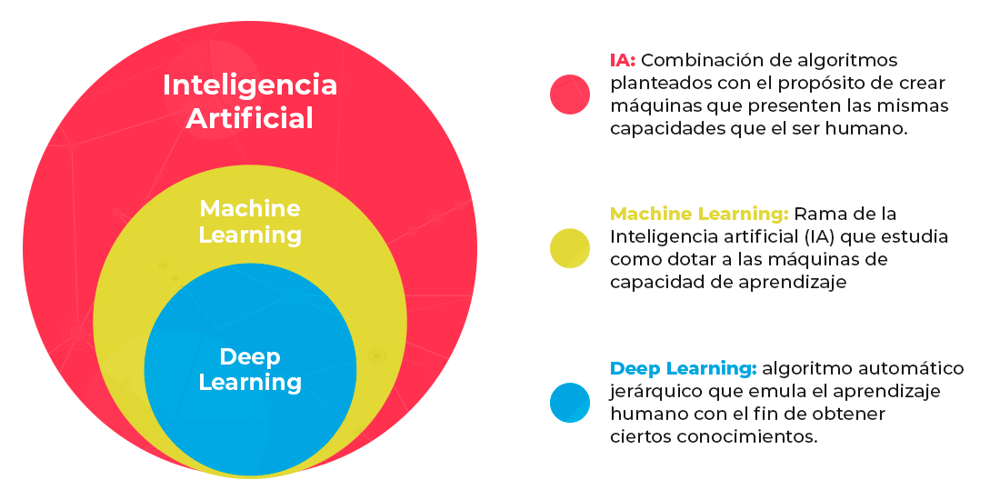
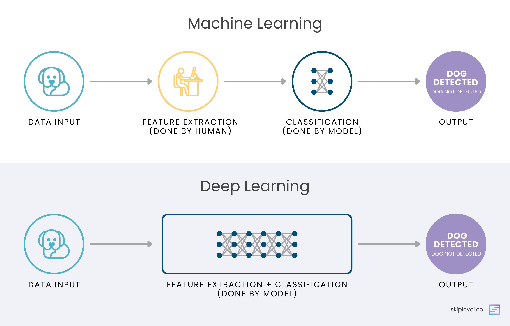
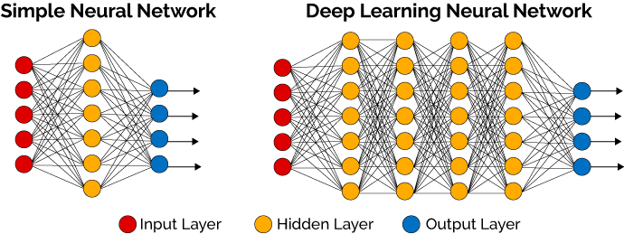
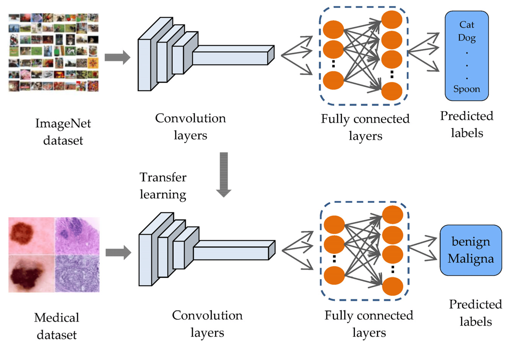
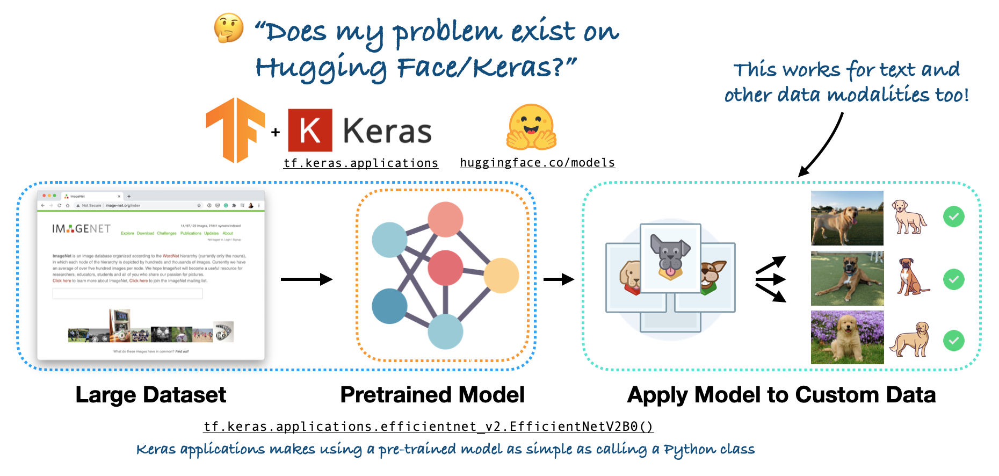

# Deep Learning (en proceso)

## Índice

1. [¿Qué es TensorFlow?](#qué-es-tensorflow)
2. [¿Qué es una GPU?](#qué-es-una-gpu)
3. [Eligiendo un modelo](#eligiendo-un-modelo-throwback)
4. [¿Qué es Deep Learning?](#qué-es-deep-learning)
5. [¿Qué son las Redes Neuronales?](#qué-son-las-redes-neuronales)
6. [Tipos de problemas de Deep Learning](#tipos-de-problemas-de-deep-learning)
7. [¿Qué es el aprendizaje por transferencia?](#qué-es-el-aprendizaje-por-transferencia-transfer-learning)
8. [Google Colab](#google-colab)
9. [Obtención de Datos](#obtención-de-datos)
10. [Exploración de los Datos](#exploración-de-los-datos)
11. [Procesamiento de Datos](#procesamiento-de-datos)
12. [Procesamiento de Imágenes](#procesamiento-de-imágenes)
13. [Construyendo un Modelo de Deep Learning](#construyendo-un-modelo-de-deep-learning)
14. [Entrenamiento y Evaluación](#entrenamiento-y-evaluación)
15. [Predicciones y Visualización](#predicciones-y-visualización)
16. [Guardar y Cargar Modelos](#guardar-y-cargar-modelos)
17. [Ajustar el modelo al dataset completo](#ajustar-el-modelo-al-dataset-completo)
18. [Enviar el Modelo a Kaggle](#enviar-el-modelo-a-kaggle)

## ¿Qué es TensorFlow?

[TensorFlow](https://www.tensorflow.org/?hl=es) es un marco de trabajo de código abierto desarrollado por Google que permite **construir, entrenar y desplegar modelos de machine learning y deep learning**. Su versatilidad y escalabilidad lo convierten en una herramienta popular tanto en investigación como en aplicaciones comerciales.

Dentro de TensorFlow, también puedes usar [Keras](https://www.tensorflow.org/guide/keras?hl=es-419), un marco complementario conocido por su facilidad de uso y simplicidad.

### Características principales

- Soporta operaciones en CPU y GPU para un entrenamiento rápido.
- Facilita la construcción de modelos avanzados como redes neuronales convolucionales y recurrentes.
- Integración con [TensorFlow Hub](https://www.tensorflow.org/hub?hl=es) para usar modelos preentrenados.
- Diseñado para implementaciones escalables en servidores, dispositivos móviles y la nube.

> - 🔗 [Tutoriales de TensorFlow](https://www.tensorflow.org/tutorials?hl=es)
> - 🔗 [Guía TensorFlow](https://www.tensorflow.org/guide?hl=es)
> - 🔗 [Recursos educativos TensorFlow](https://www.tensorflow.org/resources/learn-ml?hl=es)

### ¿Por qué usar TensorFlow?

TensorFlow te permite manipular datos y escribir algoritmos de aprendizaje profundo usando código Python. Además, cuenta con capacidades integradas para aprovechar hardware acelerado como GPUs (unidades de procesamiento gráfico) y TPUs (unidades de procesamiento tensorial). Muchas de las compañías más grandes del mundo [impulsan sus cargas de trabajo de aprendizaje automático con TensorFlow](https://www.tensorflow.org/about/case-studies?hl=es-419).

**Ventajas**

1. **Escritura de código rápido:** Compatible con Python y optimizado para GPUs.
2. **Acceso a modelos preentrenados:** La biblioteca [TensorFlow Hub](https://www.tensorflow.org/hub?hl=es) ofrece una amplia gama de modelos listos para usar.
3. **Pila completa:** Permite manejar todo el ciclo de vida del modelo, desde el preprocesamiento de datos hasta el despliegue.
4. **Respaldo de Google:** Originalmente diseñado y usado internamente por Google, ahora es una herramienta de código abierto ampliamente adoptada.

> 🔗 [¿Por qué TensorFlow?](https://www.tensorflow.org/about?hl=es)

## ¿Qué es una GPU?

Una [GPU (Graphics Processing Unit)](https://en.wikipedia.org/wiki/Graphics_processing_unit) es un procesador especializado en realizar cálculos matemáticos en paralelo, lo que la hace ideal para entrenar modelos de deep learning que requieren operaciones matriciales intensivas.

> 🔗 [Unidad de Procesamiento gráfico](https://es.wikipedia.org/wiki/Unidad_de_procesamiento_gr%C3%A1fico)

**Ventajas en Deep Learning**

- **Entrenamiento rápido:** Las GPUs pueden procesar grandes cantidades de datos simultáneamente.
- **Eficiencia en redes neuronales:** Optimizadas para manejar operaciones con tensores, comunes en deep learning.

## Eligiendo un modelo (Throwback)

Seleccionar el modelo adecuado depende del tipo de problema y los datos disponibles.

### Problemas con datos estructurados (tablas)

Este tipo de datos se organiza en forma tabular, con **columnas que representan características (features) y filas que representan instancias**.

**Modelos recomendados:**

- **CatBoost:**
  - Especialmente bueno para datos categóricos y tabulares con relaciones complejas.
  - Es eficiente, incluso sin un preprocesamiento extenso.
- **XGBoost:**
  - Modelo basado en árboles de decisión, ideal para problemas estructurados.
  - Es potente para tareas de clasificación y regresión, siendo rápido y escalable.
- **Random Forest:**
  - Combina múltiples árboles de decisión entrenados en subconjuntos aleatorios de datos para mejorar la precisión y evitar sobreajuste.

### Problemas con datos no estructurados (imágenes, texto, audio)

Este tipo de datos **no sigue una estructura definida**, como fotografías, clips de audio o documentos de texto.

**Modelos recomendados:**

- **Redes neuronales profundas:** Utilizan arquitecturas como redes convolucionales (CNN) para imágenes, o redes recurrentes (RNN) para secuencias como texto o audio. Pueden aprender representaciones jerárquicas directamente de los datos.
- **Transfer learning:** Consiste en usar un modelo preentrenado en un gran conjunto de datos (como ImageNet) y adaptarlo a tu problema específico. Esto es útil cuando tienes pocos datos.
- **TensorFlow Hub:** Biblioteca que proporciona modelos preentrenados listos para ser reutilizados, como clasificadores de imágenes o modelos de procesamiento de lenguaje natural.

## ¿Qué es Deep Learning?

[Deep Learning](https://en.wikipedia.org/wiki/Deep_learning) es una rama del machine learning que utiliza [redes neuronales profundas](<https://en.wikipedia.org/wiki/Neural_network_(machine_learning)>) para aprender patrones complejos en los datos. Es especialmente útil en aplicaciones como reconocimiento de imágenes, procesamiento de lenguaje natural y sistemas de recomendación.



**Ejemplo práctico:** Una foto puede convertirse en números (valores de píxeles rojo, verde y azul) y esos números se manipulan matemáticamente a través de cada capa para aprender patrones en la imagen.

**Ventajas:**

- Capacidad de trabajar con grandes volúmenes de datos no estructurados.
- Automatiza la ingeniería de características al aprender directamente de los datos.



**Términos importantes:**

- **“Deep” (profundo):** Proviene del número de capas en la red neuronal.
- **Relación con AI y ML:**
  - Inteligencia artificial (IA): Tecnología general.
  - Aprendizaje automático (ML): Subcategoría de IA.
  - Aprendizaje profundo (DL): Subcategoría de ML.

#### ¿Para qué se utiliza el aprendizaje profundo?

El aprendizaje profundo alimenta la mayoría de las aplicaciones modernas de inteligencia artificial. Algunos ejemplos incluyen:

- **AI predictiva:** Como modelos que aprenden relaciones entre datos (e.g., fotos de perros y sus razas) para hacer predicciones futuras.
- **[AI generativa](https://en.wikipedia.org/wiki/Generative_artificial_intelligence):** Que crea algo nuevo, como texto o imágenes, a partir de un input.

**Ejemplos de AI predictiva:**

- [Coches autónomos de Tesla](https://www.tesla.com/AI) que detectan objetos en la carretera.
- [Reconocimiento facial](https://machinelearning.apple.com/research/recognizing-people-photos) en aplicaciones como Apple Photos.
- Asistentes de voz como Siri o Google Assistant.
- [Nutrify](https://nutrify.app/) utiliza IA predictiva para reconocer alimentos en imágenes.
- [Magika](https://google.github.io/magika/) utiliza aprendizaje profundo para clasificar un archivo según su tipo (por ejemplo, .jpeg, .py, .txt).
- [Los modelos de clasificación de texto](https://huggingface.co/MoritzLaurer/deberta-v3-large-zeroshot-v2.0) como DeBERTa utilizan aprendizaje profundo para clasificar texto en diferentes categorías como "positivo" y "negativo" o "spam" o "no spam".

**Ejemplos de AI generativa:**

- [Stable Diffusion](https://huggingface.co/spaces/stabilityai/stable-diffusion) utiliza inteligencia artificial generativa para generar imágenes a partir de un mensaje de texto.
- [ChatGPT](https://chatgpt.com/) y otros modelos de lenguaje grandes (LLMs) como Llama, Claude, Gemini y Mistral utilizan aprendizaje profundo para procesar texto y devolver una respuesta.
- [GitHub Copilot](https://github.com/features/copilot) utiliza inteligencia artificial generativa para generar fragmentos de código a partir del contexto circundante.

## ¿Qué son las Redes Neuronales?

Las redes neuronales son modelos computacionales inspirados en la estructura y función del cerebro humano. Están formadas por nodos (neuronas) organizados en capas.

### Componentes clave

- **Capas (Layers):**
  - Entrada (Input layers): Recibe los datos iniciales.
  - Ocultas (Hidden layers): Procesan los datos para extraer patrones.
  - Salida (Output Layers): Genera las predicciones.
- **Funciones de activación:** Introducen no linealidades, permitiendo a la red aprender patrones complejos.



## Tipos de problemas de Deep Learning

El aprendizaje profundo aborda una variedad de problemas. Aquí presentamos los tipos más comunes y su enfoque práctico:

### 1. Clasificación (Classification)

- **Descripción:** Asignar una etiqueta a una entrada. Ejemplo: Clasificar imágenes como "perro" o "gato".
- **Aplicaciones:** Detección de spam, reconocimiento de objetos, diagnóstico médico.
- **Modelos típicos:** Redes neuronales profundas (DNN), redes convolucionales (CNN).

### 2. Regresión (Regression)

- **Descripción:** Predecir un valor numérico continuo. Ejemplo: Estimar el precio de una casa basado en su tamaño.
- **Aplicaciones:** Predicción de series temporales, análisis financiero, predicción de clima.
- **Modelos típicos:** Redes neuronales profundas con funciones de activación lineales.

### 3. Detección de objetos (Object Detection)

- **Descripción:** Identificar y localizar objetos en imágenes o videos.
- **Aplicaciones:** Sistemas de seguridad, vehículos autónomos, monitoreo de tráfico.
- **Modelos típicos:** YOLO, Faster R-CNN, SSD.

### 4. Segmentación de imágenes (Image Segmentation)

- **Descripción:** Dividir una imagen en regiones significativas. Ejemplo: Delimitar un tumor en una resonancia magnética.
- **Aplicaciones:** Medicina, mapeo satelital, análisis de texto manuscrito.
- **Modelos típicos:** U-Net, Mask R-CNN.

### 5. Procesamiento de lenguaje natural (NLP)

- **Descripción:** Trabajar con texto o lenguaje hablado. Ejemplo: Análisis de sentimientos, traducción automática.
- **Aplicaciones:** Chatbots, resúmenes de texto, asistentes virtuales.
- **Modelos típicos:** Transformers (BERT, GPT), LSTM, GRU.

### 6. Generación de datos (Data Generation)

- **Descripción:** Crear nuevos datos similares a los existentes. Ejemplo: Generar imágenes realistas a partir de ruido.
- **Aplicaciones:** Creación de contenido, diseño asistido, simulaciones.
- **Modelos típicos:** GANs (Generative Adversarial Networks), VAEs (Variational Autoencoders).

### 7. Sequence-to-Sequence (Seq2Seq)

- **Descripción:** Transformar una secuencia de entrada en otra secuencia. Ejemplo: Traducción de idiomas.
- **Aplicaciones:** Subtitulación automática, conversión texto-voz.
- **Modelos típicos:** LSTMs, GRUs, Transformers.

### 8. Aprendizaje por refuerzo (Reinforcement Learning)

- **Descripción:** Entrenar un agente para tomar decisiones óptimas en un entorno. Ejemplo: Jugar videojuegos o controlar robots.
- **Aplicaciones:** Automatización, robótica, sistemas de recomendación.
- **Modelos típicos:** Deep Q-Learning, A3C, DDPG.

## ¿Qué es el aprendizaje por transferencia (transfer learning)?

El aprendizaje por transferencia, o **[transfer learning](https://en.wikipedia.org/wiki/Transfer_learning)**, es una técnica en la que se utiliza un modelo preentrenado en una tarea similar (generalmente en un gran conjunto de datos) y se adapta para resolver un nuevo problema. Esto es especialmente útil cuando no tienes suficientes datos para entrenar un modelo desde cero.



Implica tomar lo que un modelo o red neuronal ha aprendido en un dominio similar y aplicarlo a tu propio problema.

Por ejemplo:

- Se pueden usar patrones que una red neuronal haya aprendido de más de 1 millón de imágenes y 1000 clases en el conjunto de datos [ImageNet](https://www.image-net.org/) (un estándar de referencia en visión por computadora) y aplicarlos al problema de reconocer razas de perros.



Este concepto también es aplicable a otros dominios:

- Usar un modelo de lenguaje preentrenado (LLM) que haya aprendido patrones del lenguaje natural en la mayoría de los textos disponibles en internet y personalizarlo para un caso específico, como un chatbot.

**Beneficios principales del aprendizaje por transferencia:**

- **Resultados sobresalientes con menos datos y tiempo:** Permite obtener buenos resultados incluso con conjuntos de datos pequeños.
- **Flexibilidad:** Los modelos preentrenados en grandes conjuntos de datos pueden adaptarse a una amplia gama de tareas.

### ¿Por qué deberíamos usarlo?

1. **Ahorro de tiempo y recursos:**
   - Entrenar un modelo desde cero en grandes cantidades de datos puede ser costoso en términos de tiempo y computación. Con transfer learning, el modelo ya ha aprendido características generales que pueden ser útiles en la nueva tarea.
2. **Mejor desempeño con datos limitados:**

   - Cuando los datos disponibles son limitados, entrenar un modelo desde cero puede llevar a un sobreajuste. Al usar transfer learning, el modelo aprovecha el conocimiento adquirido previamente y mejora la generalización.

3. **Casos prácticos comunes:**
   - Reconocimiento de imágenes: Usar modelos como ResNet o VGG, preentrenados en el conjunto de datos ImageNet, para tareas específicas como clasificación médica.
   - Procesamiento de lenguaje natural (NLP): Utilizar modelos como BERT o GPT entrenados en grandes corpus de texto para tareas como análisis de sentimientos o traducción.

### ¿Cómo funciona?

- **Congelar capas:** En muchos casos, se congelan las primeras capas del modelo preentrenado, que capturan características generales (como bordes y texturas en imágenes), y solo se ajustan las últimas capas para adaptarlas a la tarea específica.
- **[Fine-tuning](https://es.wikipedia.org/wiki/Ajuste_fino_(aprendizaje_profundo):** Otra opción es ajustar los pesos de todo el modelo (o parte de él) en el nuevo conjunto de datos para mejorar la precisión.

## Google Colab

Google Colab es una plataforma basada en la nube para ejecutar código Python, especialmente útil en deep learning.

### Ventajas de Colab

- Acceso gratuito a GPUs y TPUs.
- No requiere configuración local del entorno.
- Permite compartir notebooks fácilmente.

### Configuración inicial

1. Crear un nuevo notebook en [Google Colab](https://colab.research.google.com/).
2. Configurar el uso de GPU en: `Entorno de ejecución > Cambiar tipo de entorno de ejecución > GPU`.

- Antes de ejecutar cualquier código, nos aseguraremos de que nuestra instancia de Google Colab esté conectada a una GPU.
- **¿Por qué utilizar una GPU?** El entrenamiento de redes neuronales involucra una gran cantidad de cálculos matemáticos, principalmente [multiplicaciones de matrices](https://en.wikipedia.org/wiki/Matrix_multiplication). Una GPU (Graphics Processing Unit) es mucho más eficiente que una CPU para realizar estas operaciones, lo que acelera considerablemente el tiempo de entrenamiento.

  

> - 🔗 [Ejemplo de notebook en Google Colab](https://colab.research.google.com/notebooks/io.ipynb)
> - 🔗 [Introducción a Colaboratory](https://colab.research.google.com/notebooks/intro.ipynb)

## Obtención de Datos

En cualquier proyecto de machine learning (y deep learning), todo comienza con los datos. Sin datos, no hay proyecto.

Existen diversas opciones y recursos donde podemos obtener datos para un proyecto de deep learning.

### Recursos comunes para obtener datasets

| Recurso                                                                 | Descripción                                                                                                                                                      |
| :---------------------------------------------------------------------- | :--------------------------------------------------------------------------------------------------------------------------------------------------------------- |
| [**Kaggle Datasets**](https://www.kaggle.com/datasets)                  | Una colección de conjuntos de datos sobre una amplia gama de temas.                                                                                              |
| [**TensorFlow Datasets**](https://www.tensorflow.org/datasets)          | Conjuntos de datos de machine learning listos para usar con la API tf.data.Datasets. Puedes ver la lista completa de datasets en la documentación de TensorFlow. |
| [**Hugging Face Datasets**](https://huggingface.co/datasets)            | Un recurso en crecimiento continuo con datasets organizados en varias categorías.                                                                                |
| [**Google Dataset Search**](https://datasetsearch.research.google.com/) | Un motor de búsqueda de Google enfocado específicamente en buscar datasets en línea.                                                                             |
| **Fuentes originales**                                                  | Conjuntos de datos disponibles a través de investigadores o empresas, generalmente relacionados con un producto o artículo de investigación.                     |
| **Datasets personalizados**                                             | Conjuntos de datos creados a partir de tus propios datos. Por ejemplo, tu biblioteca de fotos, documentos personales o historial de pedidos de clientes.         |

### Datos preexistentes vs. datos personalizados

Cuando trabajamos con datasets existentes, como los mencionados anteriormente, estos suelen venir preformateados y listos para usar. Por otro lado, los datasets personalizados que creamos nosotros mismos o utilizamos en un entorno corporativo a menudo requieren preprocesamiento adicional antes de ser utilizados en un proyecto de machine learning.

**Diferencias clave:**

- **Datasets existentes:** A menudo vienen con divisiones de entrenamiento y prueba ya preparadas, lo que reduce el tiempo necesario para la preparación.
- **Datasets personalizados:** Suelen requerir tareas como limpieza, etiquetado y división manual en conjuntos de datos.

### Consideraciones al usar Google Colab

Si utilizas Google Colab, recuerda que **los datos cargados en la sesión se eliminan si la conexión se interrumpe**. Para evitar descargar los datos cada vez que se reinicia la sesión, seguiremos estos pasos:

- Descargar los datos una vez desde el sitio web original.
- Guardar los datos en Google Drive, ya que Google Colab se integra fácilmente con este servicio.
- Verificar si los datos ya existen en Google Drive. Si están disponibles, los importaremos directamente a la sesión de Colab.
- Si los datos no existen en Google Drive, los descargaremos desde el sitio web original y los copiaremos a Google Drive para uso futuro.

> [!NOTE]
> 📚 **Recurso:** Para una buena guía sobre cómo introducir y extraer datos en Google Colab, consulte el [tutorial de Google Colab io.ipynb](https://colab.research.google.com/notebooks/io.ipynb#scrollTo=RWSJpsyKqHjH).

### Conexión de Google Colab con Google Drive

Existen dos opciones principales para conectar Google Colab con Google Drive:

1. Hacer clic en **"Mount Drive"** desde el menú **"Files"** en la lado izquierdo de Colab.
2. Montar programáticamente Google Drive con el siguiente código:

```python
from google.colab import drive
drive.mount('/content/drive')
```

  

### Flujo de trabajo para gestionar los datos del proyecto

Más específicamente, seguiremos los siguientes pasos:

1. **Montar Google Drive:** Esto permitirá guardar y recuperar archivos directamente desde tu unidad de Google Drive.
2. **Configurar constantes**: Definir la ubicación base donde guardaremos los archivos, las URLs de descarga y los nombres de los archivos objetivos.

```
BASE_DIR = '/content/drive/My Drive/dog-breed-identification/'
FILES = {
    'images': 'images.tar',
    'annotations': 'annotation.tar',
    'lists': 'lists.tar'
}
DOWNLOAD_URLS = {
    'images': 'http://vision.stanford.edu/aditya86/ImageNetDogs/images.tar',
    'annotations': 'http://vision.stanford.edu/aditya86/ImageNetDogs/annotation.tar',
    'lists': 'http://vision.stanford.edu/aditya86/ImageNetDogs/lists.tar'
}
```

3. **Configurar la ruta local de destino**: Definir un directorio local dentro de Colab para almacenar los archivos temporalmente durante la sesión.

```
local_dir = Path("dog_vision_data")
```

4. **Verificar archivos existentes en Google Drive:**

- Antes de realizar la descarga, se verifica si los archivos ya existen en Google Drive.
- Si están disponibles, se copian al entorno local de Colab para su uso.

5. **Descargar archivos desde la URL de destino**: Si los archivos no existen en Google Drive, se descargan directamente desde la URL proporcionada utilizando el comando `wget`.

6. **Asegurar que el directorio de Google Drive exista:** Se crea la carpeta de destino en Google Drive si aún no existe, para evitar errores al copiar los archivos más tarde.

7. **Copiar los archivos descargados a Google Drive:** Después de descargarlos, los archivos se guardan en Google Drive para garantizar que estén disponibles en futuras sesiones y no sea necesario volver a descargarlos.

> ✍🏼 **Nota: Descarga local**. Si prefieres ejecutar este proyecto de forma local en lugar de Google Colab, puedes modificar el código anterior para guardar los archivos en un directorio local en tu máquina en lugar de en Google Drive.

```
# Directorio local para guardar archivos
BASE_DIR = './data/'
os.makedirs(BASE_DIR, exist_ok=True)
```

## Exploración de los Datos

La exploración de datos es un paso crucial en cualquier proyecto de machine learning o deep learning. Antes de construir un modelo, es importante analizar y entender el conjunto de datos con el que trabajarás. Este paso ayuda a identificar posibles problemas, comprender las distribuciones y familiarizarse con las características del dataset.

### Objetivos de la exploración de datos

- Obtener una **impresión general** de los datos.
- **Visualizar muestras** para identificar patrones, inconsistencias o anomalías.
- Evaluar las **distribuciones de clases** y las estadísticas clave.
- **Detectar problemas potenciales**, como clases desbalanceadas o datos mal etiquetados.

### Pasos clave para explorar un conjunto de datos

#### 1. Revisar muestras aleatorias

Es fundamental inspeccionar al menos 100 muestras aleatorias para obtener una "impresión general" del conjunto de datos. Esto incluye:

- **Imágenes:** Muestra imágenes aleatorias para entender su calidad, resolución y contenido.
- **Textos:** Si trabajas con datos textuales, revisa muestras aleatorias para verificar su estructura y contenido. ¿Los textos son legibles? ¿Hay caracteres no deseados?
- **Audio:** Si el dataset contiene audio, escucha muestras para verificar su calidad y duración.

Esta práctica no solo te familiariza con los datos, sino que también te ayuda a identificar inconsistencias o problemas de etiquetado.

#### 2. Visualizar, visualizar, visualizar

La visualización es clave para la exploración de datos. Aunque es útil calcular estadísticas, ver los datos directamente puede revelar patrones o problemas que los números no muestran.

- Para datasets de **imágenes**, visualiza un lote de imágenes con sus etiquetas correspondientes.
- Para datos de **texto**, imprime ejemplos de cada categoría.
- Para datos **tabulares**, utiliza histogramas, diagramas de caja (boxplots) o gráficos de dispersión para explorar las relaciones entre características.

Ejemplo:

```python
import pandas as pd

# Visualizar distribución de clases
df = pd.read_csv("labels.csv")  # Archivo de etiquetas
df["class_name"].value_counts().plot(kind="bar", figsize=(10, 5), title="Distribución de clases")
```

#### 3. Analizar distribuciones y estadísticas

Evalúa métricas clave del dataset, como:

- **Cantidad de muestras:** ¿Cuántas imágenes/textos/audios hay en total?
- **Número de clases:** En un problema de clasificación, ¿cuántas clases existen? ¿Hay clases desbalanceadas?
- **Tamaño y resolución de las imágenes:** ¿Son consistentes o hay variaciones significativas?
- **Distribución de etiquetas por clase:** Identifica si algunas clases tienen muchas más muestras que otras. Las clases desbalanceadas pueden requerir técnicas como sobremuestreo, submuestreo o ajustes en las métricas de evaluación.

Ejemplo para verificar la distribución de etiquetas:

```python
# Contar el número de muestras por clase
print(df["class_name"].value_counts())
```

### Formato objetivo de los datos

Un formato común para problemas de clasificación es organizar los datos en carpetas, donde:

- Cada carpeta representa una clase.
- Las imágenes correspondientes a cada clase se almacenan dentro de su carpeta.

De esta forma tenemos una estructura clara que asocia cada muestra con su clase correspondiente.

**Ejemplo de formato de carpetas:**

```
dog_vision_data/
├── Golden_Retriever/
│   ├── img1.jpg
│   ├── img2.jpg
│   └── ...
├── Beagle/
│   ├── img1.jpg
│   ├── img2.jpg
│   └── ...
```

> [!NOTE]
> Esta estructura de formato de carpetas no solo funciona para imágenes, sino que también puede usarse para texto, audio y otros tipos de datos de clasificación.

Este formato es ideal para el aprendizaje profundo, ya que:

- **TensorFlow** y otras bibliotecas pueden leer automáticamente esta estructura para asignar etiquetas a cada clase.
- Facilita la generación de conjuntos de entrenamiento, validación y prueba.

> Como dijo Abraham Lossfunction (una adaptación del [famoso consejo de Abraham Lincoln](https://www.brainyquote.com/quotes/abraham_lincoln_109275)):  
> _"Si tuviera 8 horas para construir un modelo de machine learning, dedicaría las primeras 6 horas a preparar mi conjunto de datos."_

### Archivos de listas (`.mat`)

El dataset que utilizaremos incluye archivos `.mat` como `train_list.mat`, `test_list.mat` y `full_list.mat`. Estos archivos contienen información sobre las divisiones de los datos (entrenamiento y prueba) y la organización del conjunto de datos.

**¿Qué es un archivo `.mat`?\***

- Un [archivo `.mat`](https://www.mathworks.com/help/matlab/import_export/mat-file-versions.html) es un formato utilizado por MATLAB para almacenar datos.
- Antes de que Python se popularizara en el ámbito de machine learning y deep learning, [MATLAB](https://www.mathworks.com/products/matlab.html) era ampliamente utilizado para construir modelos y gestionar datasets.

**Abrir archivos `.mat` en Python**
Aunque los archivos `.mat` son nativos de MATLAB, pueden abrirse fácilmente en Python utilizando la biblioteca `scipy`, que ya está preinstalada en Google Colab.

- **Método para cargar archivos `.mat`:**

  ```python
  from scipy.io import loadmat

  # Cargar un archivo .mat
  mat_data = loadmat("train_list.mat")

  # Explorar el contenido
  print(mat_data.keys())  # Ver las claves disponibles en el archivo .mat
  ```

- **Uso práctico:**
  Una vez cargados los archivos `.mat`, podemos inspeccionar su contenido para entender cómo están organizadas las muestras. Por ejemplo:
  ```python
  # Ver las primeras entradas del archivo .mat
  train_list = mat_data['train_list']
  print(f"Entradas en la lista de entrenamiento: {len(train_list)}")
  ```

## Procesamiento de Datos

El procesamiento de datos es esencial para preparar la información antes de entrenar un modelo.

### Cargando etiquetas de datos

Las etiquetas son necesarias en problemas supervisados para indicar la clase o valor objetivo.

```python
import pandas as pd
labels = pd.read_csv('labels.csv')
```

### Preparando imágenes

Las imágenes deben transformarse en tensores para ser procesadas por los modelos.

```python
from tensorflow.keras.preprocessing.image import ImageDataGenerator
datagen = ImageDataGenerator(rescale=1./255)
```

### Transformando etiquetas en números

Se utilizan codificadores como `LabelEncoder` para convertir etiquetas categóricas en valores numéricos.

```python
from sklearn.preprocessing import LabelEncoder
encoder = LabelEncoder()
encoded_labels = encoder.fit_transform(labels)
```

### Creando un conjunto de validación:

Es importante dividir los datos en conjuntos de entrenamiento y validación para evaluar el rendimiento del modelo.

```python
from sklearn.model_selection import train_test_split
X_train, X_val, y_train, y_val = train_test_split(X, y, test_size=0.2)
```

---

## Procesamiento de Imágenes

El preprocesamiento de imágenes incluye tareas como normalización y transformación en lotes.

### Transformando datos en batches:

Los lotes (batches) permiten procesar conjuntos más pequeños de datos durante el entrenamiento.

```python
train_data = datagen.flow_from_directory('train/', batch_size=32)
```

### Visualizando datos:

Es fundamental visualizar los datos para verificar su integridad.

```python
import matplotlib.pyplot as plt
plt.imshow(sample_image)
```

---

## Construyendo un Modelo de Deep Learning

### Preparar inputs y outputs:

Los datos de entrada deben normalizarse y las etiquetas deben estar en formato `one-hot` para problemas de clasificación.

### Definir el modelo:

```python
from tensorflow.keras.models import Sequential
from tensorflow.keras.layers import Dense

model = Sequential([
    Dense(128, activation='relu', input_shape=(input_dim,)),
    Dense(num_classes, activation='softmax')
])
```

### Resumen del modelo:

```python
model.summary()
```

---

## Entrenamiento y Evaluación

El entrenamiento del modelo implica ajustar los pesos de la red para minimizar el error.

### Entrenar el modelo:

```python
model.compile(optimizer='adam', loss='categorical_crossentropy', metrics=['accuracy'])
model.fit(X_train, y_train, validation_data=(X_val, y_val), epochs=10)
```

### Evaluar el modelo:

```python
loss, accuracy = model.evaluate(X_val, y_val)
print(f"Loss: {loss}, Accuracy: {accuracy}")
```

### Evitar overfitting:

Se pueden utilizar técnicas como `dropout` y `early stopping`.

```python
from tensorflow.keras.callbacks import EarlyStopping
early_stopping = EarlyStopping(monitor='val_loss', patience=5)
```

---

## Predicciones y Visualización

### Hacer predicciones:

```python
predictions = model.predict(X_test)
```

### Transformar predicciones a texto:

```python
predicted_labels = encoder.inverse_transform(predictions.argmax(axis=1))
```

### Visualizar predicciones:

Mostrar imágenes junto con las etiquetas predichas.

```python
for i in range(10):
    plt.imshow(X_test[i])
    plt.title(predicted_labels[i])
    plt.show()
```

---

## Guardar y Cargar Modelos

### Guardar el modelo:

```python
model.save('model.h5')
```

### Cargar el modelo:

```python
from tensorflow.keras.models import load_model
model = load_model('model.h5')
```

---

## Ajustar el modelo al dataset completo

Una vez validado el modelo, se puede ajustar utilizando todo el conjunto de datos.

```python
model.fit(X, y, epochs=20)
```

---

## Enviar el Modelo a Kaggle

Exportar predicciones en un formato compatible con Kaggle.

```python
submission.to_csv('submission.csv', index=False)
```

---

- ¿Qué es TensorFlow?
- ¿Por qué TensorFlow?
  - write fast deep learning code in python (able to run on a GPU)
  - able to access many pre-built deep learning models
  - whole stack: preprocess, model, deploy
  - originally designed and used in-house by google (now open-source)
- ¿Qué es una GPU?
- eligiendo un modelo (throwback)
  - problema 1 (structured) -> model 1 -> structured data (catboost, xgboost, random forest)
  - problema 2 (unstructured) -> model 2 -> unstructured data (deep learning, transfer learning, tensorflow hub)
- ¿Qué es deep learning?
- ¿Qué son las redes neuronales?
- Google colab:
  - setting up
  - workspace
  - uploading project data
  - setting up our data
  - usando una GPU
  - GPU y google colab
- cargando nuestras etiquetas de datos
- preparando las imágenes
- transformando data labels en números
- creando nuestro conjunto de validación
- procesamiento de imagenes
- transformando datos en batches
- visualizando nuestros datos
- preparar nuestros inputs y outputs
- construyendo un modelo de deep learning
- summarizing our model
- evaluando nuestro modelo
- preventing overfitting
- trainning your deep neural network
- make and transform predictions
- transformar predicciones a texto
- visualizando las predicciones del modelo
- visualizando y evaluando las predicciones del modelo
- guardar y cargar el modelo entrenado
- ajustar el modelo a todo el dataset
- hacer predicciones en imagenes de prueba
- submitting model to kaggle
- hacer predicciones con nuestras imágenes
